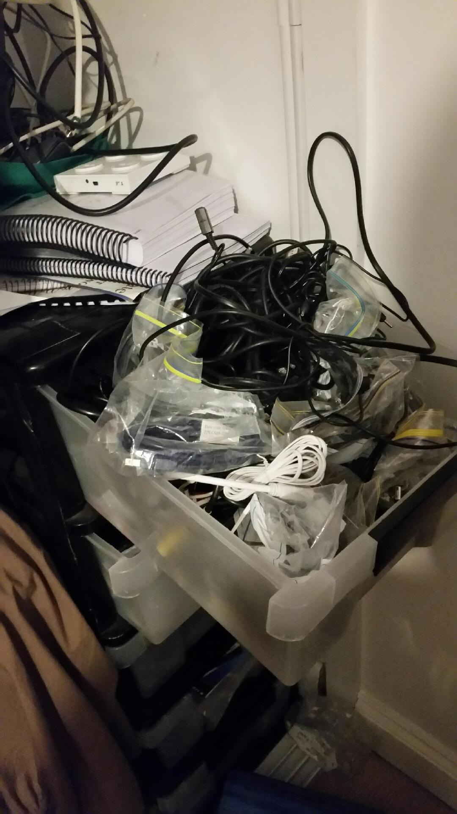

Rest in Pieces you Fracking RaspingBreathBurryDOodlePi (RIPuFRBDPi).
Rest in Pieces.
So, wife's off at Work Christmas do.
Dogs are walked, fed and washed.
I dragged out a USB keyboard and USB mouse to connect to the RBDPi to at least get Erlang onto it and to install either of RabbitMQ or emqttd - so it could maintain some semblance of dignity by acting as a messaging host.
Go figure.
I had the start-up sequencing streaming over HDMI to my monitor, got to login prompt, no response to keyboard.
So I fired up my Atom box, running 32bit Debian, and sure enough, keyboard was fine.
So, the USB ports on the RBDPi my friend gave me appear to be kaput.
Neither worked.
So, it goes to the awaiting garbage bin along with the CurieNano DFRobot wouldn't take back on warranty.
What is a real smack in the face, the ODROID C1 I inherited on the same buddy was sitting their taunting me.  I looked, for a fleeting moment, for the micro HDMI cable I have but it's in here somewhere ...
[caption id="attachment\_2987" align="alignnone" width="1080"] Have you ever seen a mating ball of grass snake?![/caption]
 
... give me a freaking break!
It's Friday.
Guess I'll wash the dishes.
POST SCRIPT
Saturday was blown going to a most-of-all-day pub crawl bucks for  a friend.
So Sunday ...
Here it is Monday and I finally found that micro-HDMI cable ... in a second mating ball of cables in yet another box.
