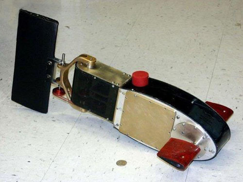
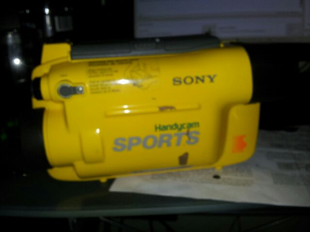
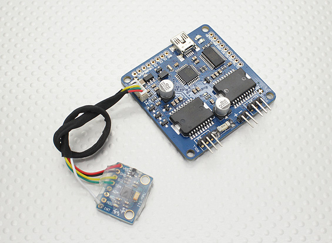

 
Go figure you don't have a realistic "fish" thing going to build a robotic fish.
With the $10 second hand handycam dive enclosure we have a body.

 
Now I was saving pennies for waterproof servos to see if they would paddle this along.
Then I noticed cheap (really cheap) camera gimbal drivers and brushless motors.  Brushless motors, in principle, can work underwater (plenty of examples on you tube) so I thought why not gimbal motors which work like servo motors.  I will have to re-code the driver but it will be to take the IMU code and replace it with sinusoidal drivers to "undulate" the tail.
I bought 4 $13 motors to try the idea out.
 
