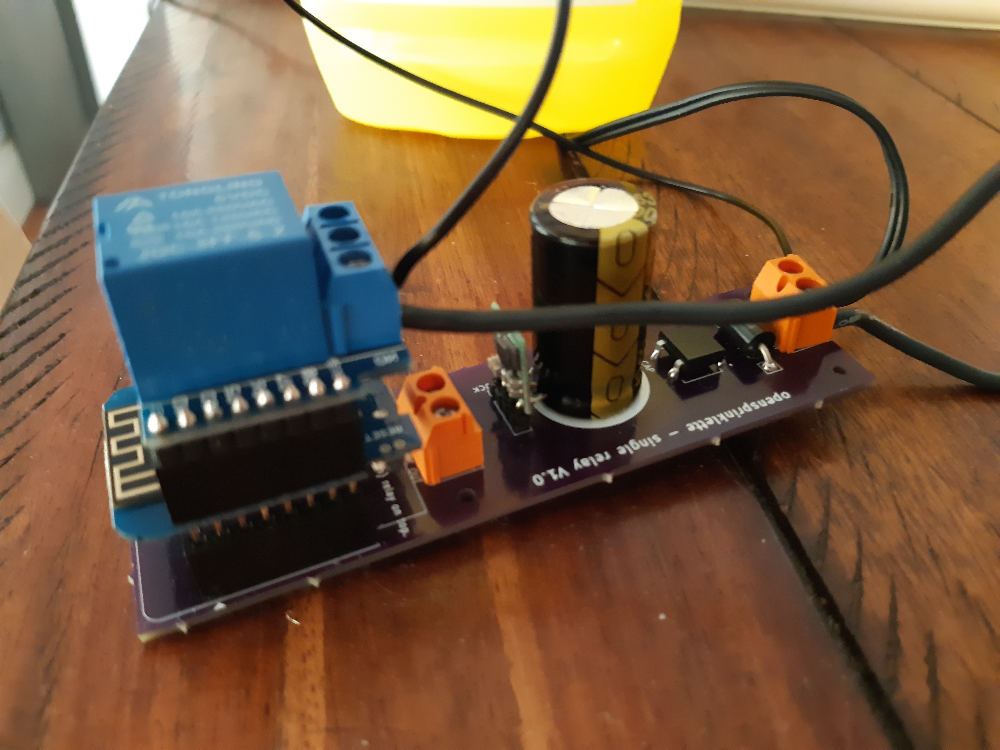

I did a retake on the components required for the 24VAC to xVDC boards, used in opensprinklette, and realized that I had bought 100uF instead of 1000uF electrolytic. Little wonder it wasn't helping in filtering the spikes caused in hot end because of solenoid activation/deactivation.

So, swapping out the 100uF with a 1000uF fixes the [crashing wemos](https://organicmonkeymotion.wordpress.com/2019/07/14/so-far-not-so-good/)!

Almost. It runs for a while then ... wemos fires up, I have a looping test in node read that turns the relay on/off every 5 seconds. The LWT will pop up after the widget goes quiet after a few cycles. I found it would reboot and start again, though would only cycle a few times before crashing. More often than not, I had to pull the powerpack from power board and restart.

Runs a treat otherwise, as long as you don't turn the relay on. All 24VAC elements appear on the correct side (the other side) of the protection, so its a little perplexing.

3 options. 1) the cap voltage rating needs boosting, 2) the TVS is too tight versus the RMS of the 24VAC input, 3) the circuit I found is a dud.

I am actually waiting on delivery of electrolytics of a higher voltage rating. Jaycar only had 60V caps. The TVS rating was on a batch I got based on an example circuit for OpenSprinkler. It it works for that then surely it should here? In any event, I have a slightly higher rated TVS batch coming.

The design I borrowed appeared to opt for a 40V design target so the cap really should have room. It will likely be the TVS (I am hoping) and then we can move on.

Bigger IS better ;)
