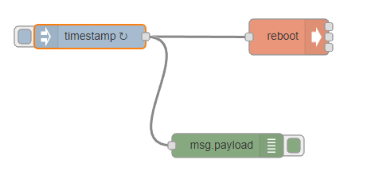

Are you still with me? I wouldn't be, it's been such a pain. Because network manager appears flaky somehow.
On the Armbian.com distro the /etc/network/interfaces file told you directly to use network manager and nmtui. This intimated that you couldn't edit up the interfaces file.
I got no joy when I edited the interfaces file, while trying to get around the flakiness that appeared to be incurred, but that could because network manager was the default service - and was not reading the file??
Now, on the orangepi.org distro, it looks like you can use nmtui/nmcli optionally but, of course, we have seen the network connection collapse.
Now I didn't look to see if at some point /etc/resolv.conf was set by network manager to some flaky value and therefore breaking the connection.
Now we have that up our sleeves as we try try yet again again.
Yes, I have an alcoholic beverage on hand.
So [orangepi.org distro installed and static IP setup](https://organicmonkeymotion.wordpress.com/2017/07/20/not-a-sausage/).
First step, install [node-red](https://organicmonkeymotion.wordpress.com/2017/07/06/starting-afresh/).
I will leave the system running until Sunday before I try installing emqttd as I want to give it a good burn in to make sure there isn't something in the node-red install breaking the ethernet.
To stress the distro I set up a cyclic reboot in node-red with the following:

I just set an interval of 5 minutes on the injector.  The debug node will scribble the timestamp on the debug console when the interval lapses.  At the same time the OPiZ is rebooted.
