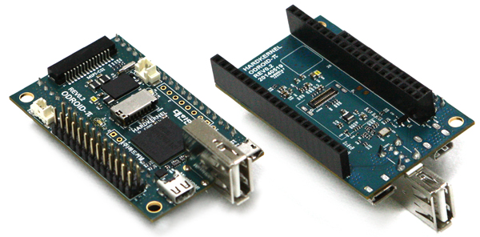

A second package turned up in my PO box from Hardkernel.  It was the extra ODROID-W for my parts drawer and also the [connector](http://www.hardkernel.com/main/products/prdt_info.php?g_code=G140610379462 "Whoops!") sets I forgot to get.  Trying out the ODROID-W plus base board was a little hard without the connectors, yes?
[caption id="attachment\_1615" align="aligncenter" width="300"] Ah! That's better.[/caption]
A little soldering etc. then bomb Rasbian onto an SD card, then dump the Erlang and, yes, the blinking LED experiment.
This weekend I promised myself.  I have already put lighting up a Beaglebone Black with the cross-compiled Erlang experiment I put together on my [32bit Debian box](http://organicmonkeymotion.wordpress.com/2014/09/17/erlang-on-bbb/ "Erlang on BBB").  I just need to sort the SD card reader/burner on that machine.
The box that turned up also included four button cells for the on-board RTC (you know the one the Raspberry Pi doesn't have).  So, I had forgotten I had ordered those, I ordered 8 button cells from them to get connectors for the board for the lipo cells, not the other day.  So it means I can sort out battery power for the board ahead of schedule.  All good.
