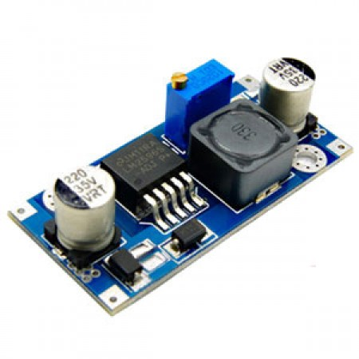

The chappy doing [OpenSprinkler gave me the best idea yet for the 24VAC to 5VDC](http://rayshobby.net/24vac-to-5vdc-conversion/) to power the OpenSprinklette stack (Wemos D1 R2, fiddly bits including VAC2VDC and pullups, relay board).
Rather involves using a LM2596S-5.
I have in my bits drawers 10 LM2596S-ADJ based modules that go for US$2 a pop in packs of 10 so I will start with that for the prototype.

For the VAC2VDC the secret is to add a 3A diode (cathode to +ve volts input) of the PSU board.  It then likely passes for the circuit at the OpenSprinklette blog.
In fact, if you solder the pullups onto the two naughty GPIO pins you need to, either on WEMOS D1 R2 or the relay board, you could get by without an intermediate board.  There is still the conditioning circuits for the flow meters, but again, since we are using mqtt there is the option of a separate system for that.  I think we are already convinced that the rain gauge can twerp to an mqtt topic for example.  Although, there may be traction in a shield board for people who want no more than four zones and one unit - at least with the rain gauge input and 24VAC to 5VDC ... oh and those pesky pullups.
Note we still need do something like string all the relay commons together now don't we.
I guess the more interesting thing going on with the rain input of the OpenSprinkler is the use of a surge protection across the rain gauge input that has a Transient Voltage Suppression diode.  The selected value appears to be 48V which seems a lot but the gadget is used for [ESD threats to the board](http://www.microsemi.com/document-portal/doc_view/14650-how-to-select-a-transient-voltage-suppressor) (aka lightning - not strike likely but nearby EM field, up to a point).
This is actually necessary especially when there is  likely a long "antenna" from the rain gauge to the unit.
Might be less need if an ESP8266 is connected at the gauge and the solar panel and charger (we'll need a battery to run at night time) are similarly "close by".  [Already solved in any event.](http://chynehome.com/web/station-meteo-a-base-de-esp8266-2/)
Hmmm.  [Lightning detection](http://www.embeddedadventures.com/as3935_lightning_sensor_module_mod-1016.html) ...
