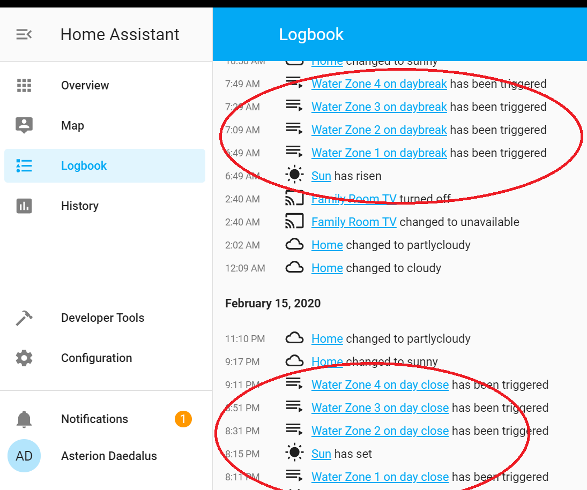

So, who knows why the Zone 1 sprinkler goes off 4 minutes before sunset? No, I am not asking. I am seriously not going to ask on the Home Assistant "help" as I am not feeling I need wade through any "unhelp". There is quite obviously a hiccup but for the purposes to which I put this hack, who really cares?

The easiest way around the problem of watering the zones in succession was NOT trying a trickle of triggers. I thought about it and I simply had four triggers on sun events or states that had four different delays before spilling into the action section. As I have timers on the zones, to turn them off automatically after 15 minutes, I simply triggered on sun state, sun state + 20 minutes, sun state + 40 minutes and then sun state + 60 minutes (aka 1 hour).

Good enough for a home setup with four sprinkler zones. Though I will be adding more zones as I go. One idea is to use ball valves instead of the 24VAC valves. That way you can use a solar cell and battery setup and plant them any place you like (away from the mains and the 24VAC powerpack).

So I need design another board. That will be a real version 2.0.
