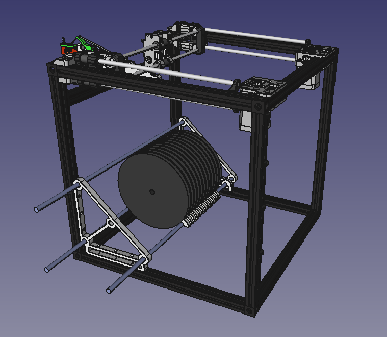
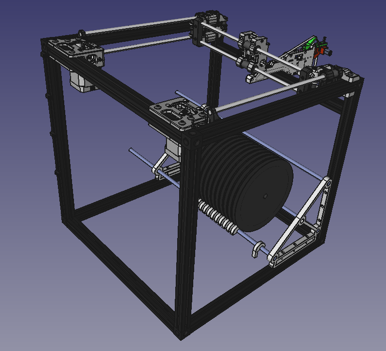
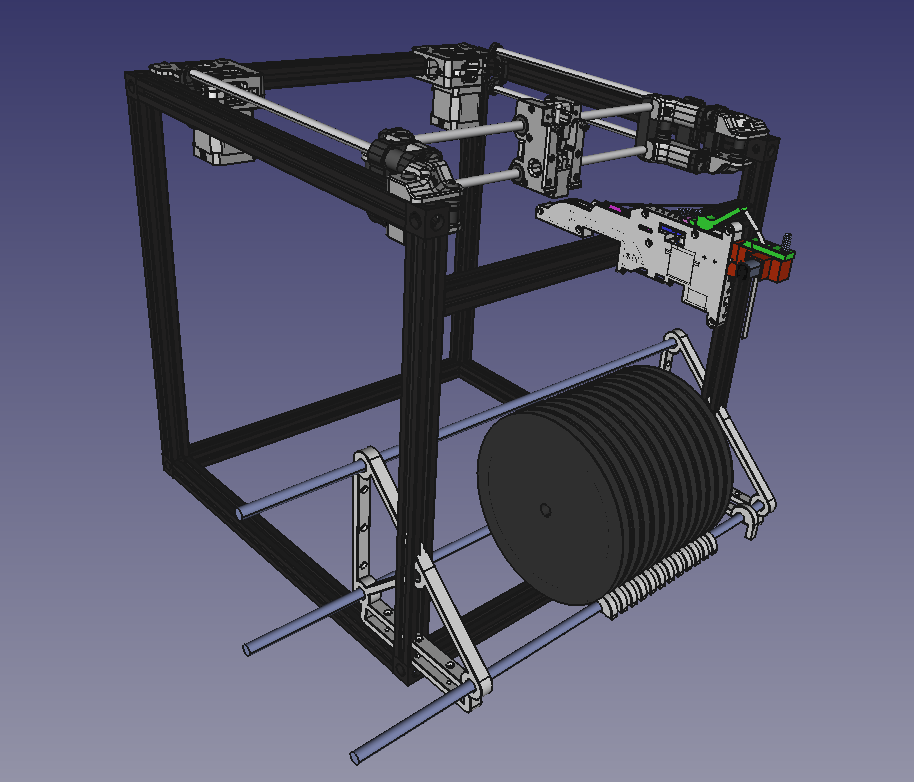
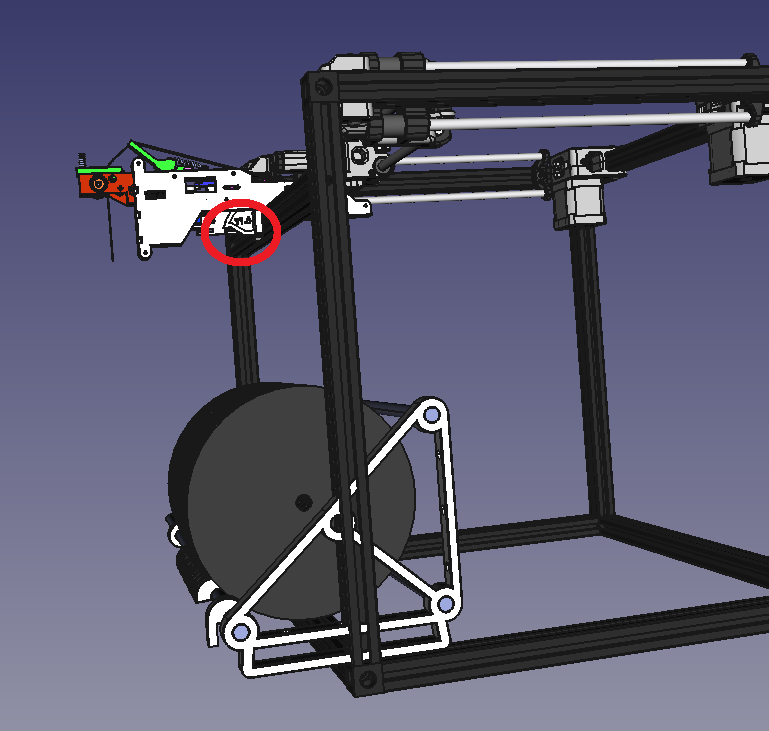
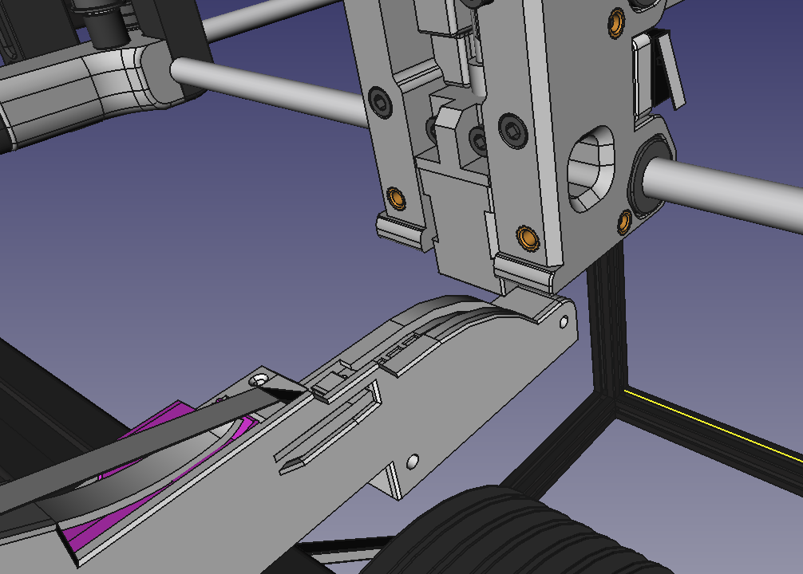

So, I threw the parred back Voron Legacy, with both a feed and a spool holder to find not a bad fit without having to fiddle, though I expect once beds and other things go in that there'll be fiddling.

So Figure 1 is the basic idea. I was able to tune the spool holder only so far. I couldn't adjust the rods, but I will fiddle further with that.

Figure 1

Figure 2 is rotated the other way. Not sure which orientation the holder should go, but I suspect this orientation won't make sense from the point of view of the feeder.

Figure 2

Figure 3 may be closer to the solution. I would need redesign the spool holder, no problem. This makes sense since it's forever rotating the spools into the frame.

Figure 3

Figure 4 shows why this is needed. You can see the pickup point for the tape circled in red. Noting, however, I need have additional horizontal rails to take the working area, I could potentially move the feeder mount inwards somewhat. Still need play with this. I could also make the sides longer and leave the X/Y axes alone. If I used an additional 100mm say. So 6x650mm and 4x550mm.

Figure 4

Figure 5 shows how, with the starting position, the feed seems to meet up with the X-carriage without any fudge - it has sufficient room for the Z-axis.

Figure 5
