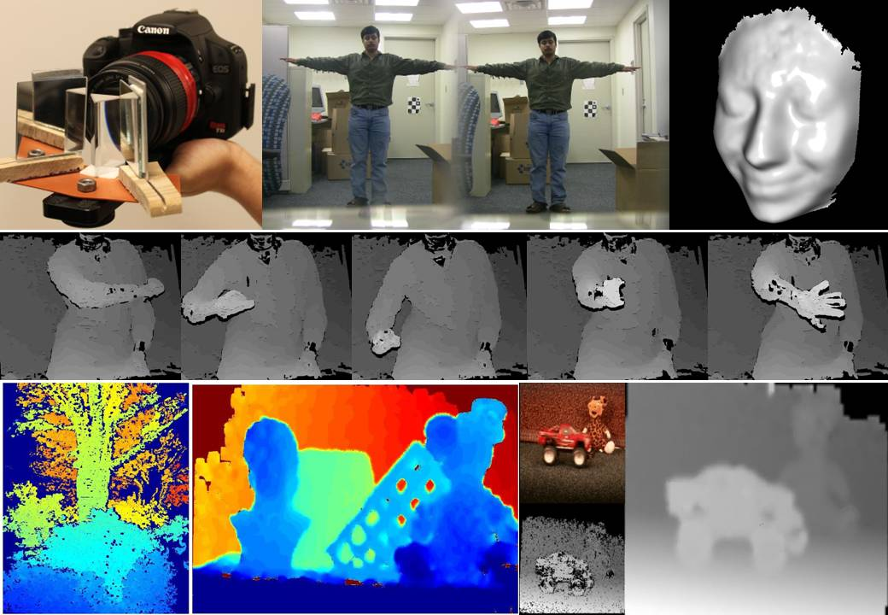
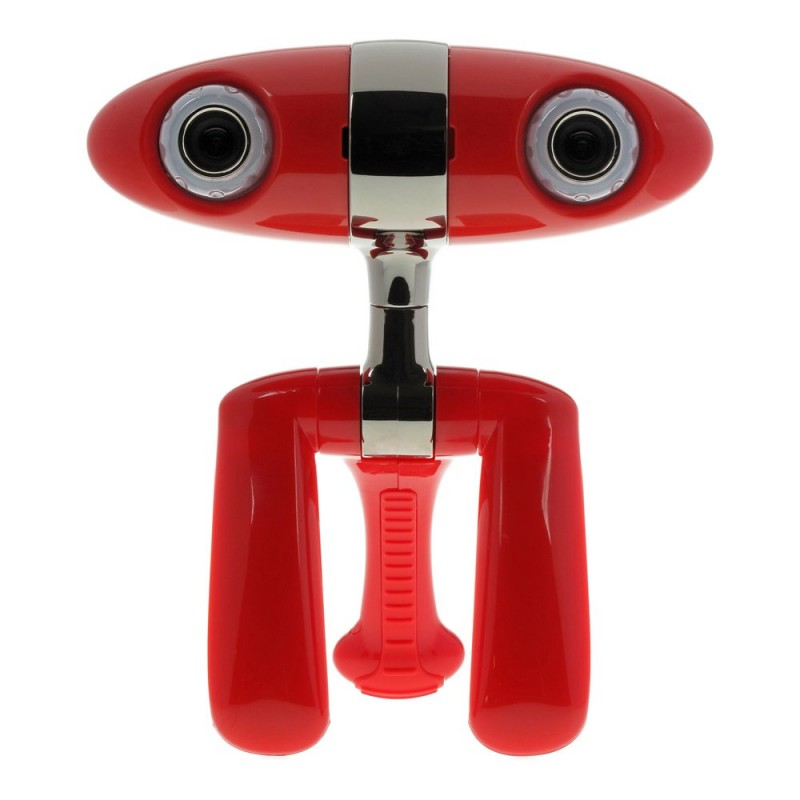
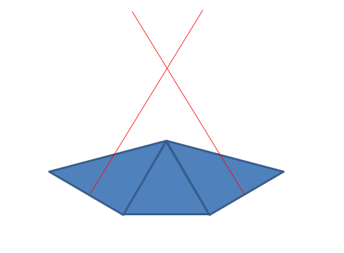

Go figure. Here I am looking into stereo depth for 3d reconstruction.  Leap at $70 doesn't give you depth maps.  [Structured Sensor](http://www.kickstarter.com/projects/occipital/structure-sensor-capture-the-world-in-3d "Structured Sensor") has finally pinged me and want $340 for a prototype development system - with favors iOS and not Android.
I have looked at dual cameras but was looking for something that could be kept small and voila!  All I need is an [equilateral prism](https://www.eecis.udel.edu/wiki/vims/index.php/Main/PrismStereo "equilateral prism") and a couple of mirrors.
A quick web search and small prisms go for $5 to $90 depending upon the quality.
Alternative is, of course, breaking down a ...

... but if I can get it sorted on one of my old Android phones that would be neat.

### POST SCRIPT

Prisms on their way. Looking forward to playing with this idea.

### POST POST SCRIPT

I ordered one equilateral prism from one place and (I thought) two right angle prisms from another.
The idea that the right angle prisms would act to set the mirrors precisely so I didn't have to fiddle around with construction.
Ala...

Granted, the final setup might need mirrors at >90 degrees to get depth but for the initial algorithmic games it would do.
However, vendor who was supposed to send two right angle prisms sent two equilateral.  So, vendor apologizes and offers me 5% off any subsequent purchases.
Not good enough, do you know why?

Currently in negotiation to have vendor send correct prisms.
