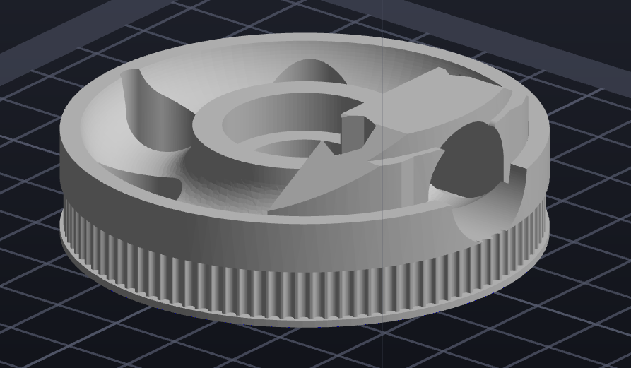
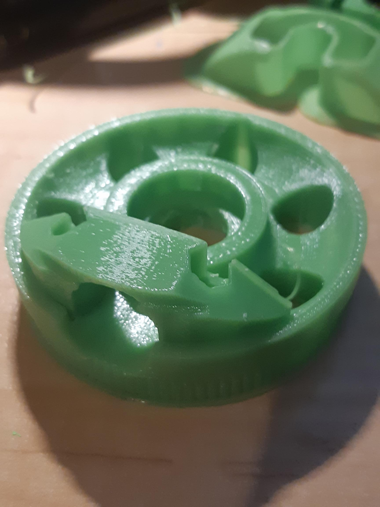

Notice the difference?

Just playing with minor mods to the uStepper 4 model to get around a really irritating design decision by the original author. That is using 15mm diameter aluminium tubing. Since, I am finding multiple places aluminium tubing jumps from 14mm to 16mm! Same pattern in carbon fibre tubing.

So, just fiddling with hacking this part from 15mm to 16mm fitting. Using the Manipulator add-in to great effect to reverse engineer centre point of cut, based upon the radius of the cut. Then using the centre provided to site the new cylinder to cut a new chunk out. The trick is that as the rod is thicker, it also had to be lifted a tad (0.5mm) away from the teeth of the belt drive. So a similar fiddle in the bracket.

I'll do a test print at some stage, before moving onto some of the other parts. In fact, the bracket is on the printer right now, burning through that horrible green colour I opted into out of an urge to homage.

UPDATE

So, turned out not bad in draft print.

Draft print for 16mm shaft

I need to grab some 16mm shaft to try this. I did find 15mm carbon fibre on Aliexpress but don't really want to wait. But, with the bank up of project, I guess I could.

While the green filament is loaded, I am knocking up a few 8mm feeders for my PnP as well.
