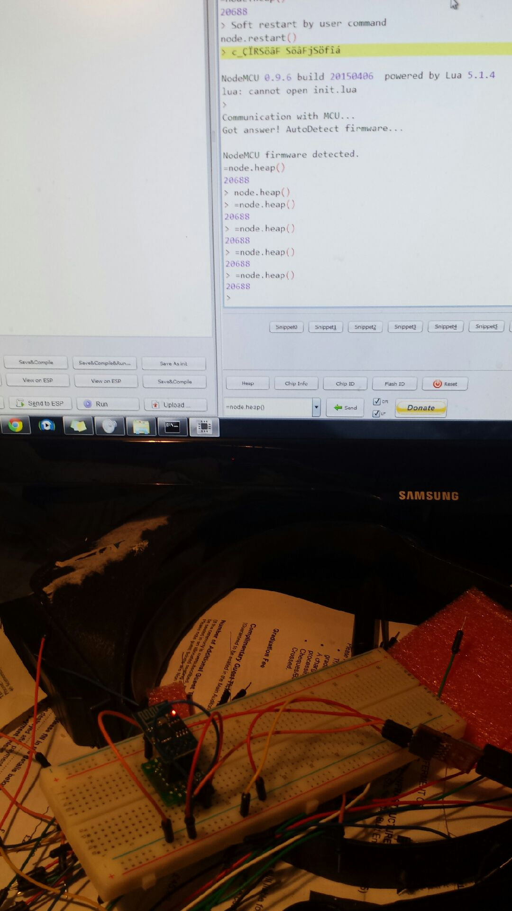
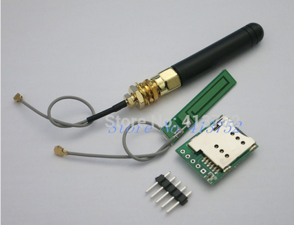

So, finished an online 8 week course I was interested in doing.  MOOC no less.  Not sure about them as my feeling was you don't get much connectivity with teaching end and it would appear that MOOC are not hitting their target audiences.
I am going to do one on first order logic, for my stuff I play with at work (I am moving into formal languages).  Another will be on AI planning (for fun at home).  In any event, some time to kill so I wired up a breakout to mount an ESP8266 on a breadboard to try out nodemcu, and voila!
[caption id="attachment\_1773" align="aligncenter" width="169"] Hello world from nodemcu[/caption]
Now my wife wants a few things around the house, like burglar detection down the alleyway etc.  So I have a batch of IR detectors and the nodemcu can email detections no less.  The alternative is to SMS via a cheap GPRS module:
[caption id="attachment\_1775" align="aligncenter" width="300"] Tini![/caption]
Now this was under $10 and the module is the size of a phone MicroSIM card.  TBD
