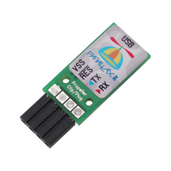
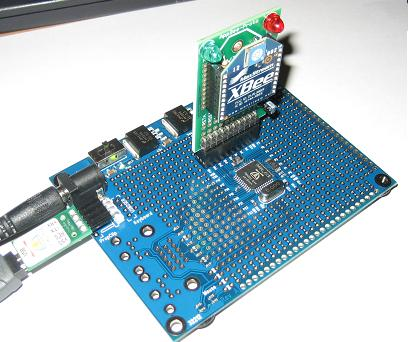
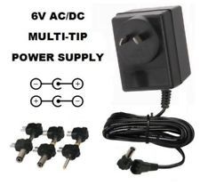

Almost blew up my Parallax prototyping board.
First up, the board needs a "prop plug".

To convert the USB to a serial connection. The Plug signals are clearly marked but the prototype board has no pin descriptions.  There appears no obvious information in any of the manuals.
I came to me searching the Internet for a photo of a prototype board with plug attached to give me "the hint" - labels up!  In hindsight, the prob plug manual helps a little bit if you took the USB socked down - based on the Prop Clip - as "the hint".  Not sure why the detective work should be needed.  Likely someone too familiar with the boards was writing the manuals.

 
Next was the power.  From the circuit for the Prob Plug it was obvious it didn't power the board so a trip up to Dick Smith's for a 6V power adapter.
Trick was the glyph on the board was not the standard glyph for showing center tap on power connectors and I got it around the wrong way - as the symbol for -ve was also the symbol for "center tap".
A little heat and smoke as one of the regulators tried to de-solder itself.
I caught it in time, swapped the socket and was able to finally download software first into RAM and then into EEPROM.
In hindsight the mechanical drawings in the board's manual made the center polarity clearer but ...

... is the familiar glyph.
