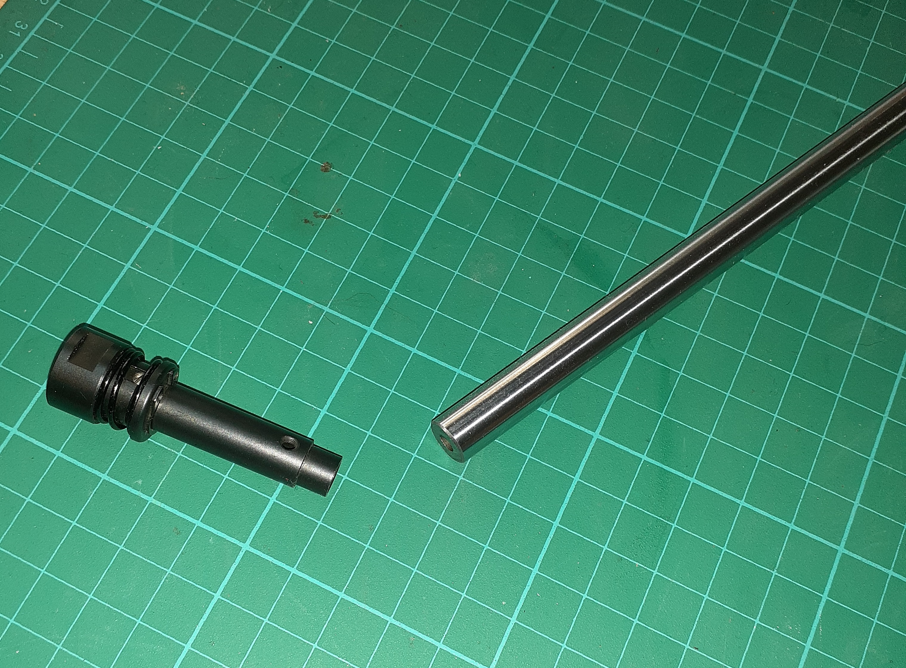
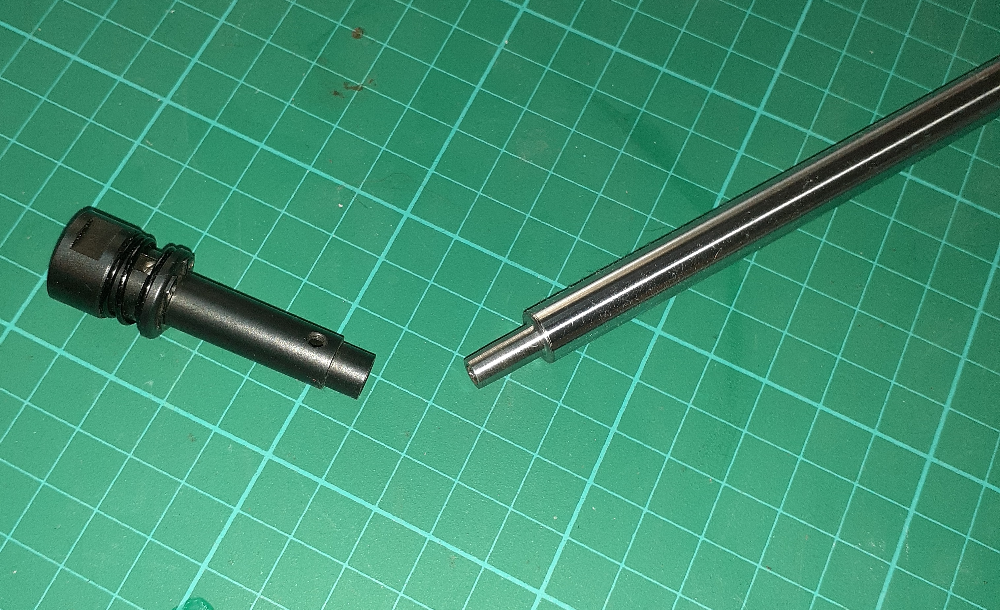
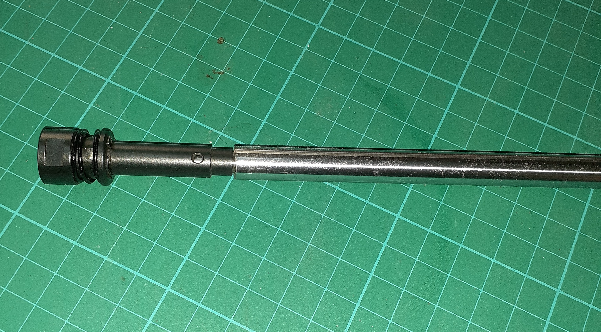
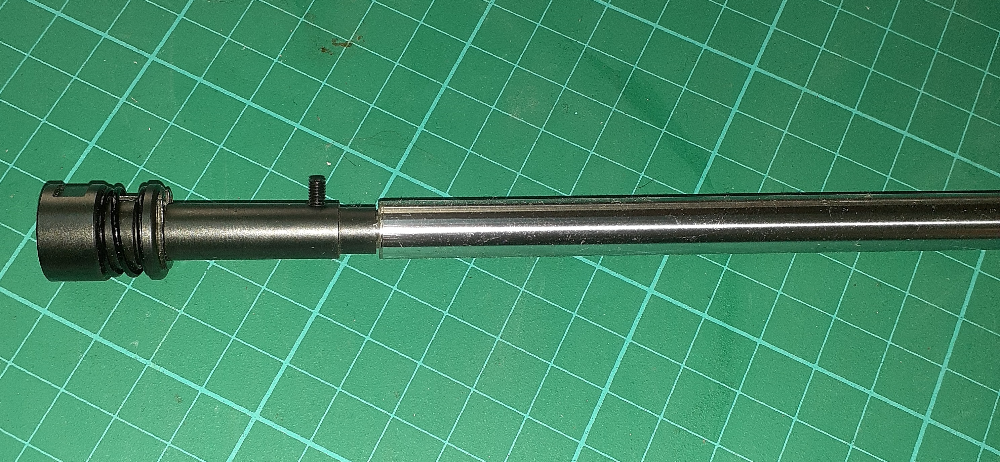
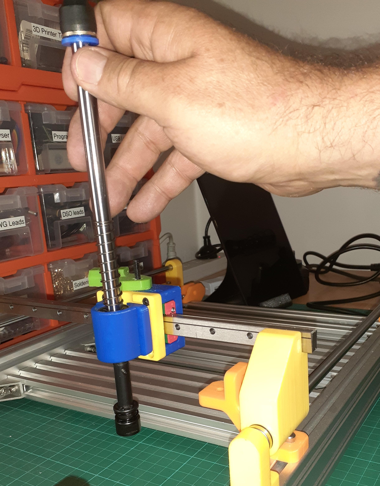
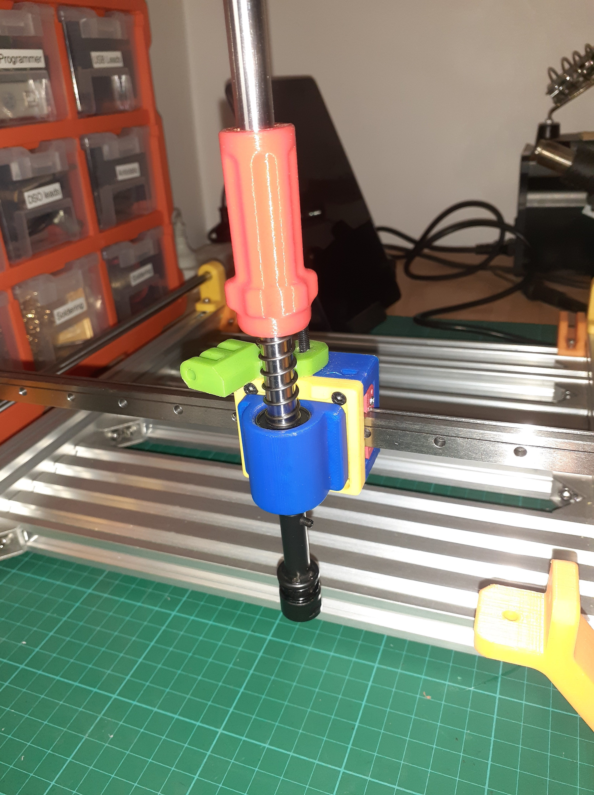
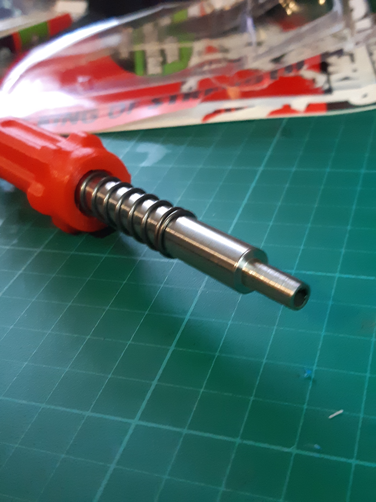
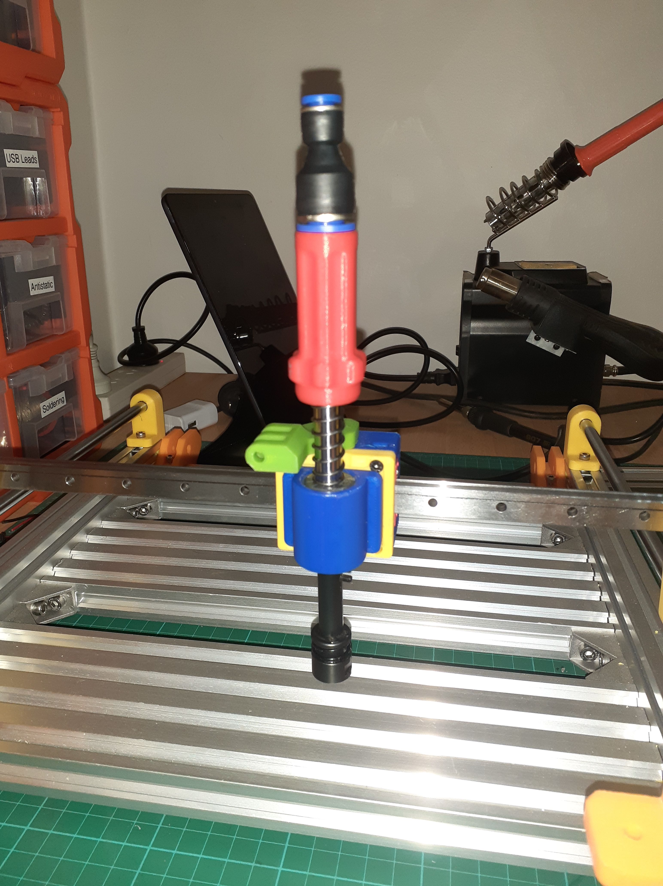

The problem, hollow liner rod but how to connect?

The solution, turn end down to 6mm from 10mm

Slips in

Has a threaded hole for a 3mm grub (larger grub for illustration purposes)

Rod is too long, so I will need grind down to size.

It's been a while but I can do a sprint on the manual PnP build again. I opted into not using aluminium tubing, as was used in the original design. Try getting 10mm aluminium tubing that is actually 10mm and therefore will play nice with the linear bearings used in the x-carriage.

My next problem is the handle inner diameter is too tight for the rod. I am flitting between drilling it out and then using a heat insert or two so I can lock it in place with grub screws. Or, redesign so it better fits in first place.

No problem, just use a 10mm wood bit to (carefully) open up the central hole

The business end ...

In the meantime, I am opting to change the design of my magnetic holder, as I decided to use the actual VORON Legacy x-carriage and make an adaptor. That way I can start building the thing, as the z-axis re-design can happen in parallel.

https://www.youtube.com/watch?v=rDZOpYVucGk

Final z-axis, with hollow liner rod cut down to size

Can you [see the resemblance](https://www.thingiverse.com/thing:3644398)?
