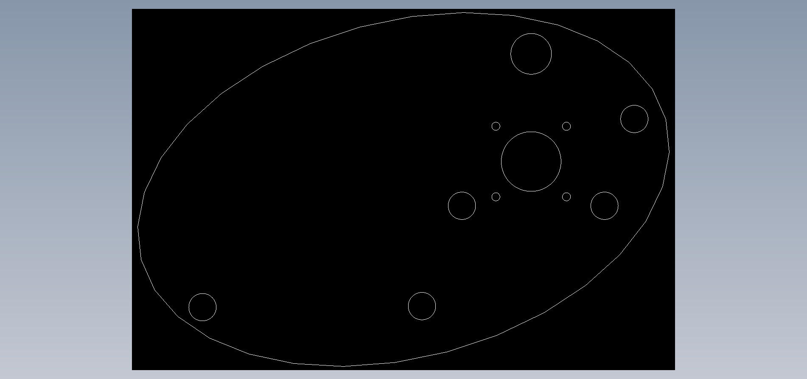
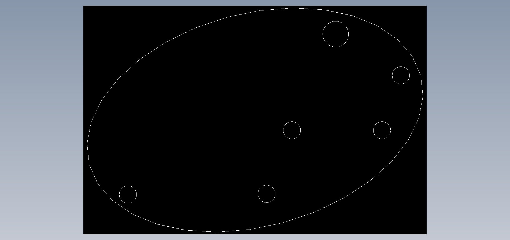
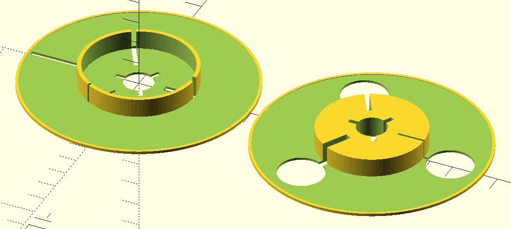
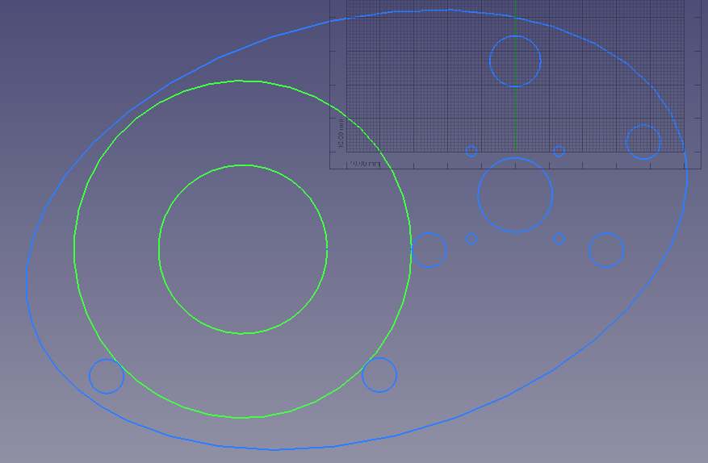
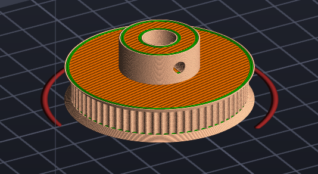
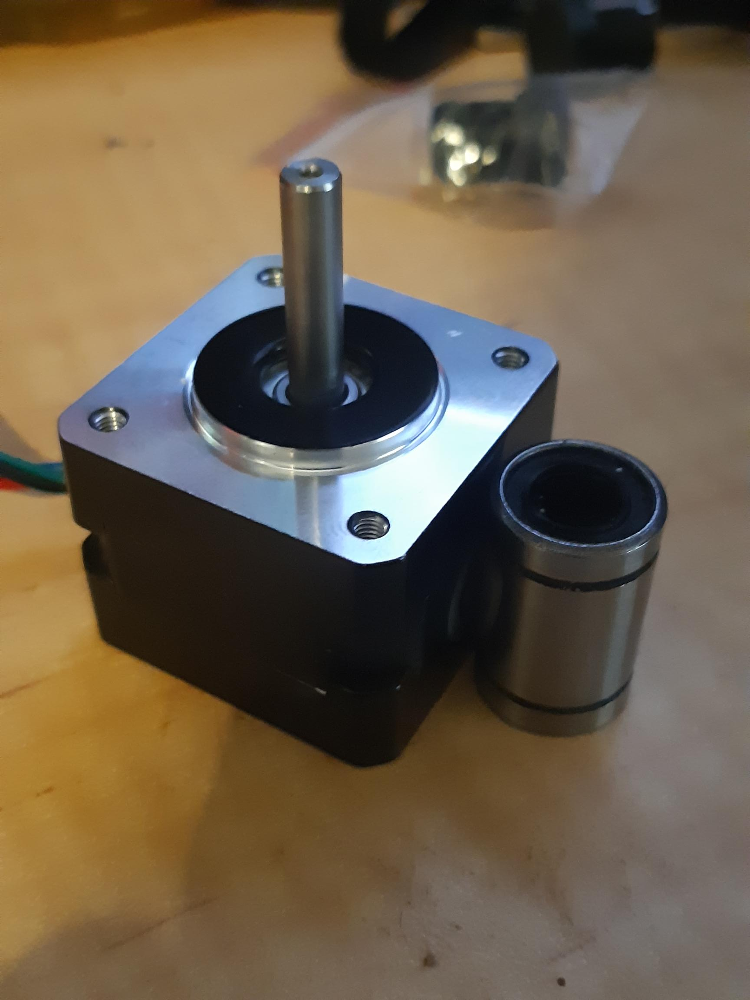
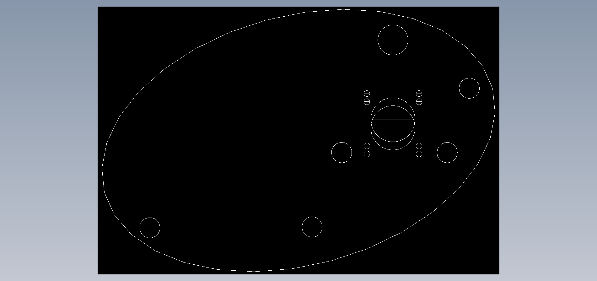
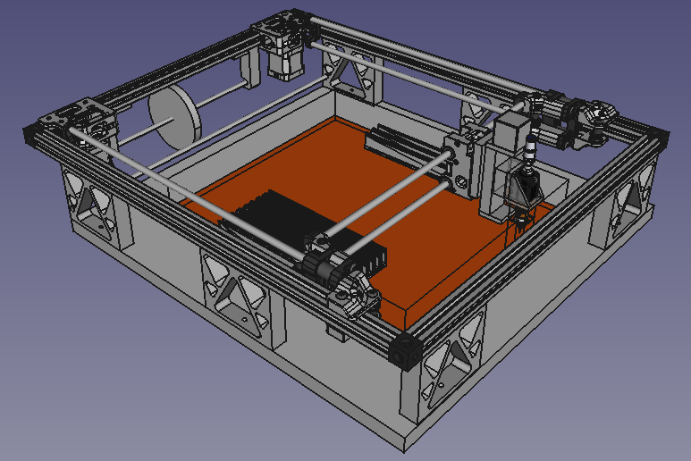
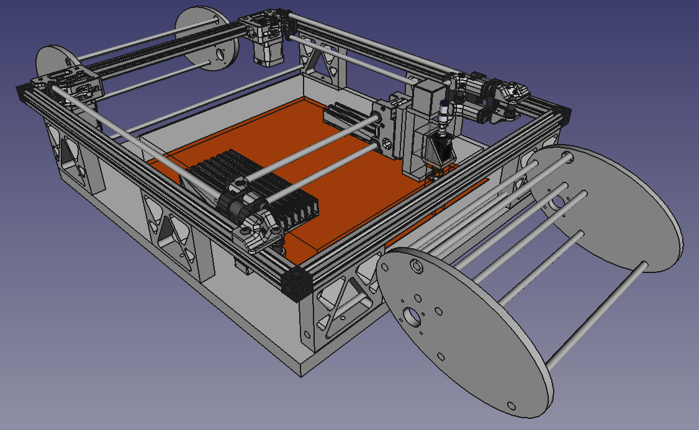

So, while still waiting on a few things to finish builds, I decided to go for broke and really stack up projects, to make sure nothing ever gets done ... ROTFLMAO!

Figures 1 and 2 are the ends for the SMT tape collector. To get there I hacked a prototype in FreeCAD suing Parts Design adding with sketches and a few other tools. I looked at the problem of 3D printing these - not the least of which was having the Bear Build complete OR going through the hassle of having the makerspace printer for 12 hours (when everyone else is lined up to print Pikachus).

So, why not do my first laser cut project in 9mm MDF?!

A little frustrating since with grouping of parts, using sketches etc., when exporting to dwf all manner of crap was included. So, after modelling in 3D to sort out a range issues, I then went back to Draft add-in and started from scratch, lifting dimensions off the 3D prototype model.

The design is to take [5x10.10mm aluminium tubes](https://www.bunnings.com.au/metal-mate-10-x-1mm-1m-aluminium-round-tube_p1067742) for the frame members that, in places, the cover tape will slip over. Three is a 15mm diameter hole to take an LM8UU bearing. The LM8UU will allow the rotating 8mm linear rod that will have the "skidding" collections spools.

Per Figure 3 and 4, the mini-reels (100mm dia with 50mm dia hub) will run on 3 of the aluminium rails.

I am trying to print a 70 tooth GT2 pulley at the moment. My Finder is playing up at the moment, I have had to unblock the Microswiss hot-end, BUT now I forever cannot get the sticking PLA to stick to the new bed sticker, so I have to go up the road to get some sticky glue.

Figure 6 is the NEMA 14 I thought would suffice to drive the thing. Yes that is an LM8UU linear bearing sitting next to the stepper!

Makerspace is closed this weekend as they are off at a community science thang, so next weekend I'll grab me some 9mm MDF board and have that first real go at a laser cut.

Figure 1

Figure 2

Figure 3

Figure 4

Figure 5

Figure 6

What? Oh yeah, some tensioning of the pully belt for the collecting spools might be apt, so update is a Figure 7. To achieve this, given we're using a laser, is just have some overlapping circles and rectangles.

Figure 7

So, whether I can retrofit such a SMT cover tape collector to my corexy PnP design is, yes, a question (Figure 8). One trick is to use the mini reels (100mm) and, since I would have to load them myself, invert the tap, to run it over an 8mm linear rod embedded in one of the stands. As a start mind you, very crammed that end when the x-gantry goes back there.

Figure 8

But, of course, it may make more sense just adding SMT cover tape collectors when using tape reels per Figure 9.

Figure 9

What? Yes, I do have to update the 3D model of the SMT cover tape collectors from the new and improved 2D work. You are a hard audience!
