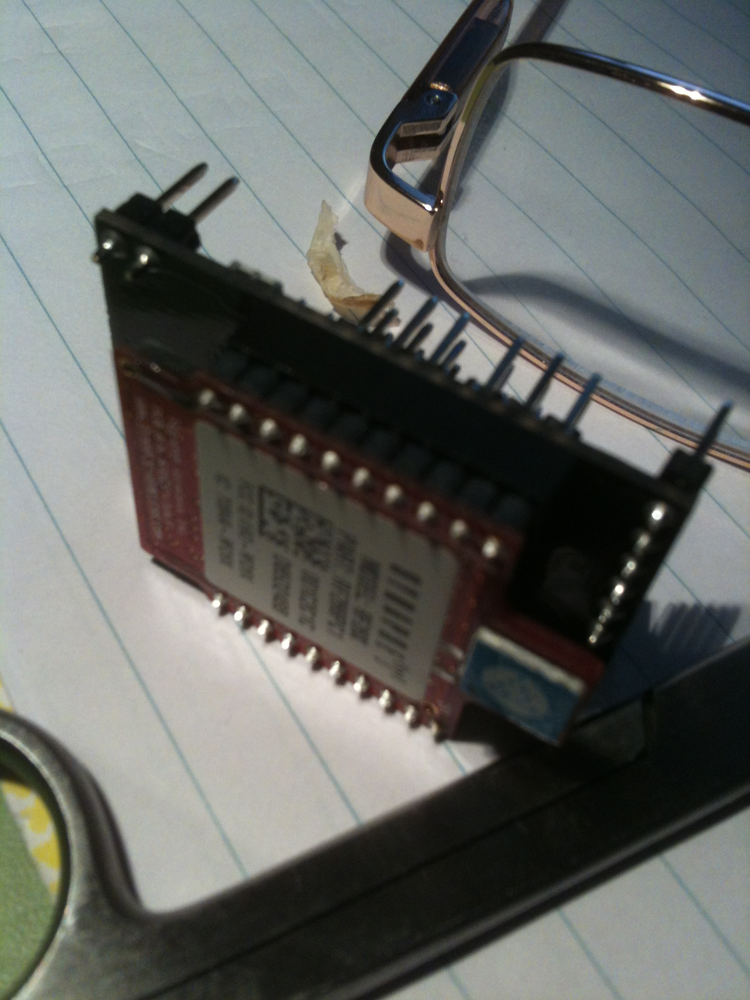

So, a rough start to using SNAP but a good bit of understanding now.
One exciting discovery is the SNAP Connect Python code has had a change in licensing and you can use it FREE for up to 10 nodes (not including Portal or the PC root node).
I have been looking at integrating SNAP networks with ROS and ROSPy seems to be the go - but I really need to build a LINUX box so ...
Along with the ROSPy there are various other libraries I have been grabbing for rpc in Python and connecting to CORBA (OmniPy for OmniORB).
The SNAP connect can be used over networks yadda so pretty cool (I am thinking of introducing my nephew to robotics and the ability for him to control things my end or me to upgrade software at his end is a great feature - we live about 1000km apart).
**DESIGN DECISIONS**
Now that I am flying with SNAP I am looking at a basic bit of code to run on the [Flyduino](http://www.dfrobot.com/wiki/index.php?title=Flyduino-A_12_Servo_Controller(SKU:DFR0136) "Need servo controller ++ with XBEE socket to take RF266PC1") to allow me to run it remotely via the SNAP Connect Python code.
Ahead of this I have been looking at the schematic and, while it allows for 12 servos to be controlled, I will limit this to 9 to give me the SPI channel.  [Also wik](http://www.skeptictank.org/files//en001/grailsub.htm "Always look on the bright side of life ..."), while the Flyduino provides 8 Analog in I will look at whether I can keep pins 27 and 28 for an I2C channel.   This will allow for some smart sensors on the [Swash Bots](http://organicmonkeymotion.net/Platforms.php "Swagger is the main thang ").  This will allow for gaits to be run from the PC until they are too finely tuned.
Also 6 servos and use D8, D9 and D10 for chip selects for the SPI bus or inputs for bumpers ... oh yeah, already decided on visual [odometry](http://organicmonkeymotion.net/blog/?p=183).
The little board is actually quite flexible, below is the SNAP RF266PC1 (XBee clone) sitting in the socket.  I am looking into the simple mods to allow (perhaps) programming the Flyduino wirelessly.

