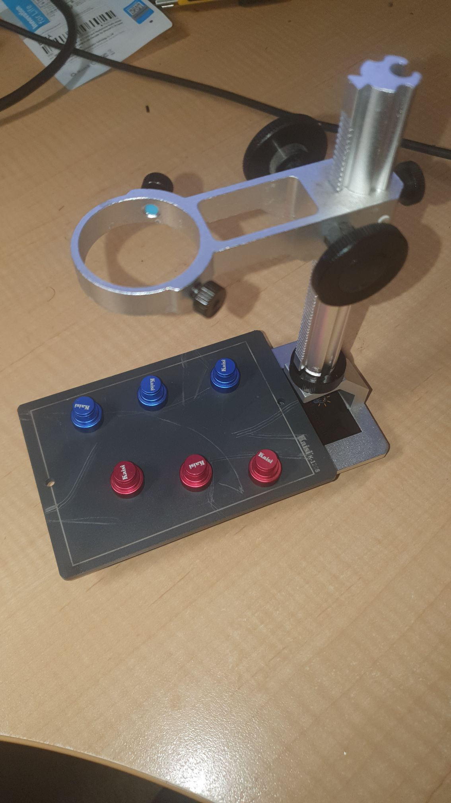
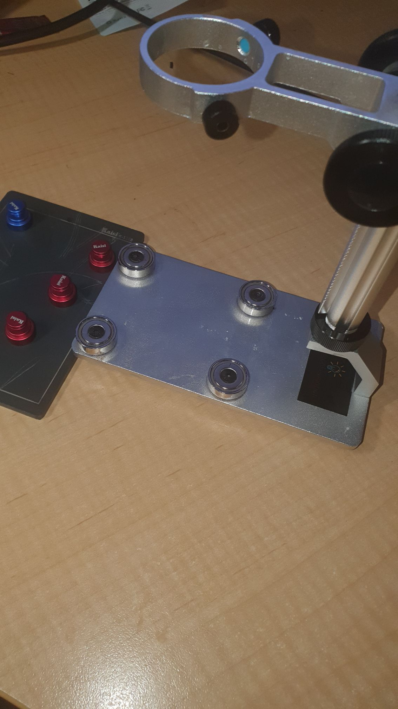

So I had double sided taped a steel plate used for pcb wrangling, mitt the typical magnetic pcb holder widgets. However, I'd often want to rotate the dang thang and opted out of that since the double sided tape was not budging without a lot of stripping and cleaning.

Hence, I took the microscope holder to the makerspace and drilled four M4 holes, tapped those suckers and then used short M4 pan heads to hold down four rare earth magnets mitt der countersinking.

Works a treat, though I did go for quite strong magnets, so I have to take care not to tear me fingernails off when wrangling the steel plate on and off ...

... mwa mwahaha mwahahahahahahahaha!
