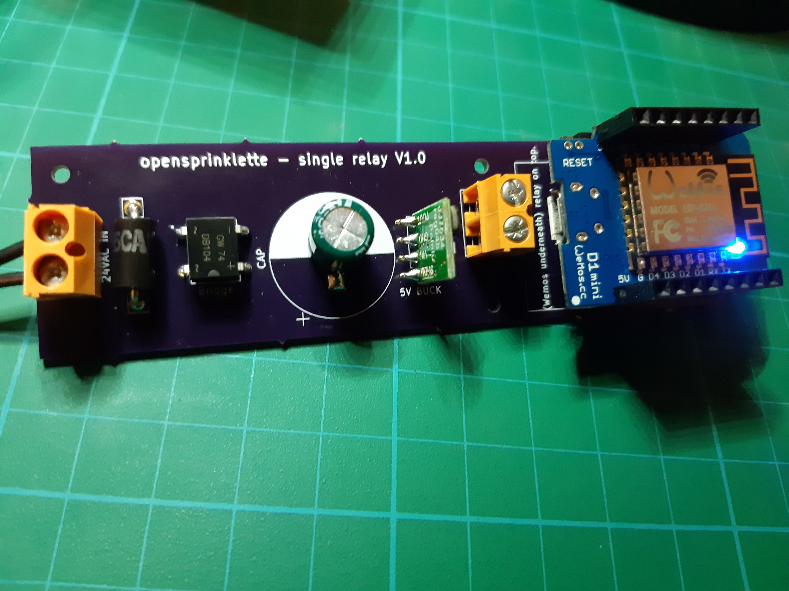

So. I will need to redesign, as I used too big a cap template. Otherwise, it seems to power the board fine. I will need bomb opensprinklette onto the wemos for some testing.

Out of shot is the 1 AMP 24VAC power pack.

Missing is still the single relay shield, to be plugged into the Wemos D1 mini.

The redesign will shrink the 24VAC - 5VDC section.
