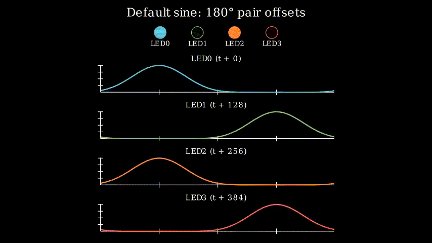
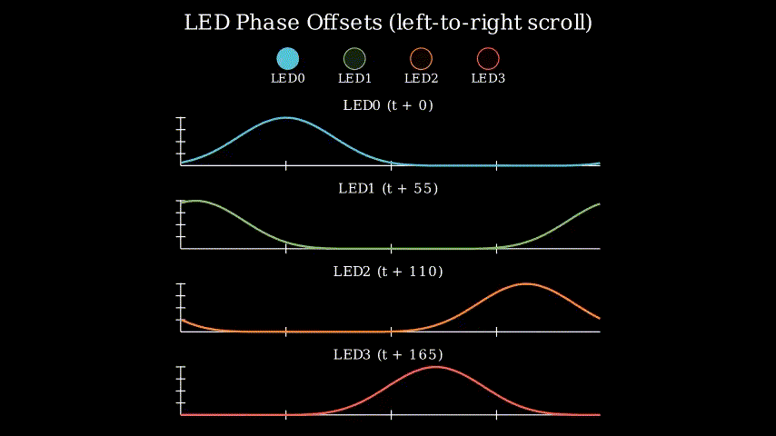
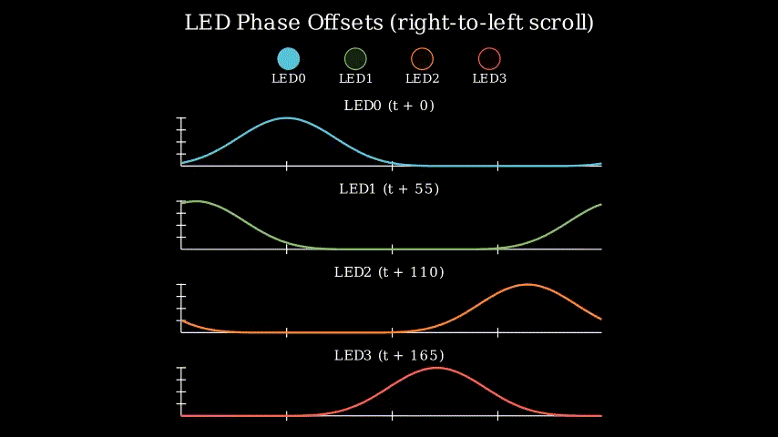
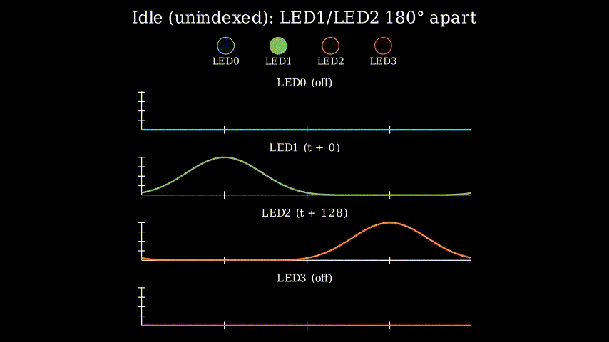
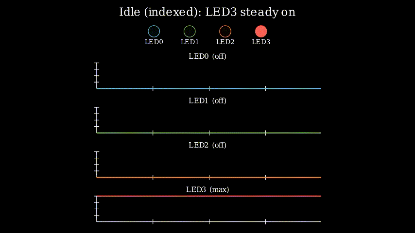

As part of the porting of pick-plaz to ESP32 (from STM32), I carried out analysis of the behaviour of the LED0..LED3 string. While doing the usual web skimming for nothing in particular, I came across Manim. Manim is a python library for doing mathematical simulation graphics.

Hence, I give you the pick-plaz LED0..LED3 behaviours.

## Default Sine:

## Forward:

## Backward:

## Unindexed:

## Indexed and idle:

