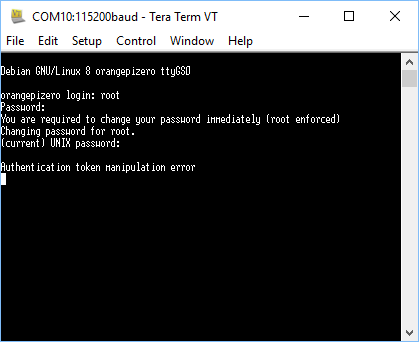

... after all the fanfare:

So, this is the problem that I reported on armbian site that got me in trouble.  Or at least one of the problems.
So, the feeling was that because I had burnt Armbian 5.25 with WIN32DiskImager it was a file system corruption.
The error actually hints that the file system is in read only state.  So it is the only problem, amongst the raft of problems with Armbian on OPiZ, that might be tied to FS.  Or is it.
This is, however, an Armbian 5.30 burnt with Etcher.
Etcher did not complain of corruption on the SD card after the burn.
Makes no nevermind even if you erase disk first with SDFormatter.
In fact when I put this pic up on Armbian site, I was told that the fault was a read only problem with the SD card.
The issue was actually, I jumped into typing in the new password I wanted to set the device to.  In fact (if you read the command line) I was supposed to type in the default password 1234 again.
So much "help" pointing me at SD corruption, and no one picked I might have simply typed in the wrong password at that step.  Me as well but golly gee I do have to take care getting sucked in by the "help".
 
