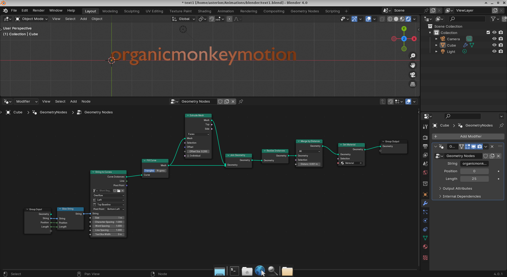
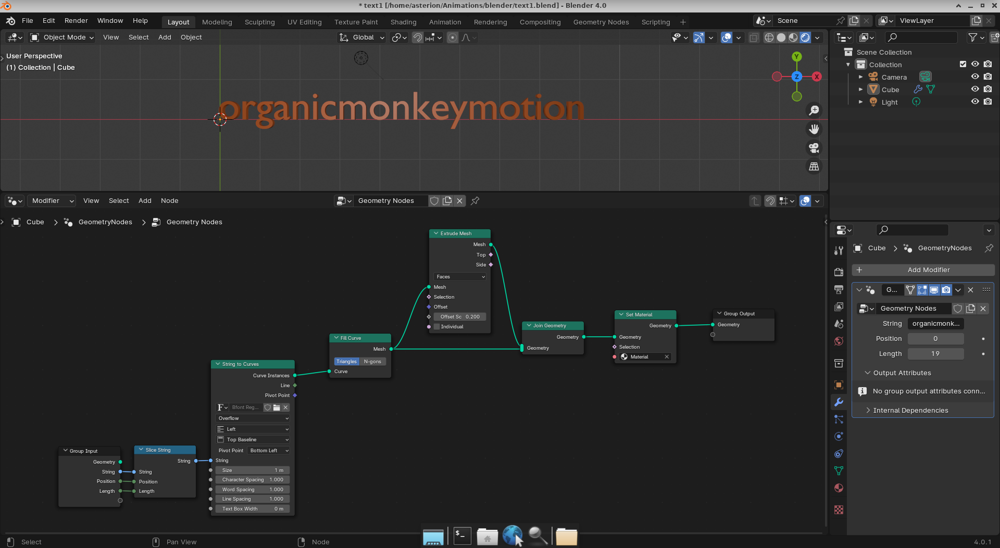

Yeah, so the problem with the tutorial below is that the mesh islands means lower case elements like "i" and "k", and probably "j", are treated like two meshes so when animating by island index the characters have two animate parts. Meaning "abc" is 3 "islands", whereas "ijk" is 6 "islands". There is some reference in the comments to "instance indices" to "delete" characters, that avoids use of "islands", but there is no reference to a specific geometry node nor how it would be weaved through the nodes to get the effect. The effect is essentially the text appears one character at a time.

https://www.youtube.com/watch?v=7GUHVgqhnlM

I fiddled with this and I simply added a "Slice String" node and the string, its length and position are parameters. So, playing with the length parameter gives you same effect as the more complicated approach in the tutorial. However, you do not have the problem caused by using "islands" since you retain the per (whole) character control. That is both "abc" and "ijk" are 3 characters. Additionally, you get a separate animation effect using the "Slice String" length.

The simplified geometry node model.

In fact, you seem to be able to get away with this simple setup.

https://www.youtube.com/watch?v=dX6PHiMS8Hc
