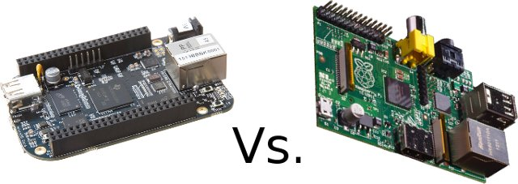
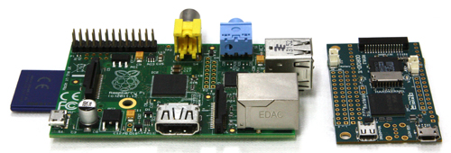
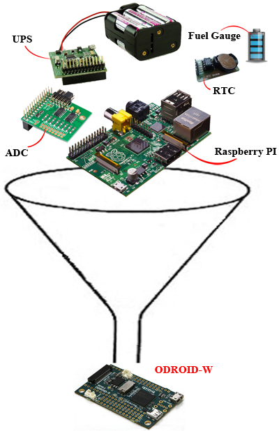
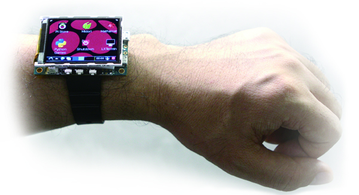
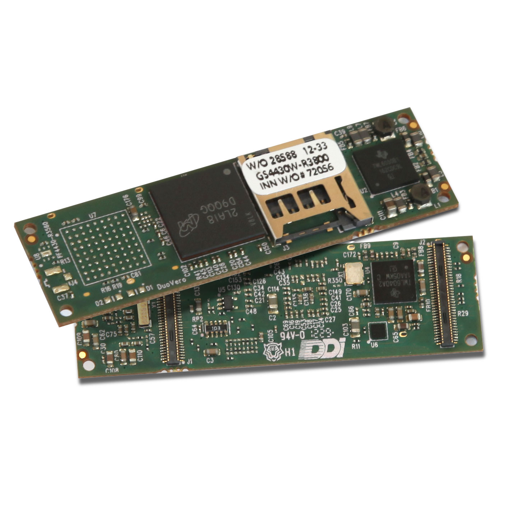
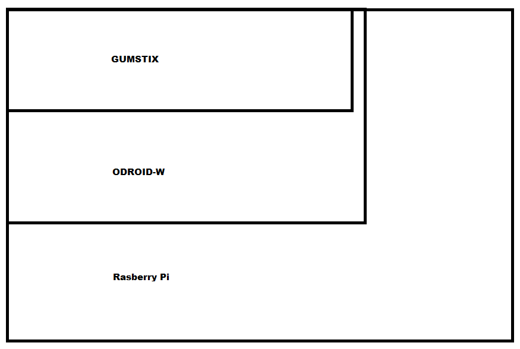

[caption id="attachment\_1561" align="aligncenter" width="300"] No competition, really. Grown up board for serious work vs a primary skool diddling board[/caption]
[First BBB (the other Creative Commons offering) vs Raspberry Pi](https://www.youtube.com/watch?v=Tbk_Z_8macI "The other Creative Commons offering").  Say no more.  More grunt, more I/O, better connectivity.  Apparently looses out (only) because 1) cannot connect to an old analog television (who still has one of those?) 2) only has 1 usb port (well done Raspberry Pi, woo hoo) 3) and is scary for beginners (there there little gimp, you can upgrade to BBB when you are ready).  [[PS: [you can actually get to the analog video if you have to](http://forum.odroid.com/viewtopic.php?f=104&t=5905&p=47554&hilit=rca#p47552 "Well, you can can afterall")]]
So ODROID-W vs Rasberry Pi.
Same Creative Commons hardware design base?  Only from the point of view of same SOC.
Same reliance on free OS and free software applications.
Smaller footprint for embedded rather than (so-called) PC applications.
[caption id="attachment\_1552" align="aligncenter" width="300"] Match box vs Credit Card size[/caption]
Comes with more on it (but there is a twist):
[caption id="attachment\_1553" align="aligncenter" width="194"] How did they do it?[/caption]
What is actually missing off there picture is that ODROID-W sort of addresses a short coming with Raspberry Pi by also adding eMMC - but this is somewhat knobbled because the Broadcomm chip that RPF chose is somewhat a slug here and you only get a 10% improvement in speed.  But, you still have that option.
Now you only get one USB host port, much the same as BBB ... but there is still the twist to come.
Now the twist, you don't really get Ethernet until you add a base board.
[caption id="attachment\_1554" align="aligncenter" width="300"] The base board[/caption]
Now voila!  With base board you get ethernet and four USB ports - better than Pi or BBB - so likely no need for USB hub at all.  You don't have to have the baseboard with the LCD if you don't wanna ;)
So, baseboard without LCD $20, with $30.  So more expensive than Pi?  Well not if you include RTC, UPS, ADC and fuel gauge, and four USB instead of two (so take off price of USB hub) AND an LCD.
Sad fact.  You still can't connect to that old analogue television that you don't have anyway :(  You'll have to settle for the LCD ;)
Now, I don't myself think what I want this for is to build my own Smart Watch ...
[caption id="attachment\_1555" align="aligncenter" width="300"] No, no, never, never no watch[/caption]
... lest [Steve Wozniak make a Youtube about it](https://www.youtube.com/watch?v=5uEP7USoewc "No, no, never, never no stinking android watch").
Rather, the matchbox format means more horse power on smaller robotics platforms - way cheaper than the original trendsetters at [Gumstix](https://store.gumstix.com/index.php/products/285/ "Nice but too expensive, too proprietry").  All of the [Gumstix base boards](http://gumstix.org/hardware-design/overo-coms/73-overo-design/113-schematics.html "Go figure, another CC licence that lets you implement the open design") (not the computer modules) are Creative Commons for you to use in making up your own designs for baseboards - striking an interesting balance.  But still, emphasizing that the hardware design is the thing that is open and encourages your own implementations.
[caption id="attachment\_1557" align="aligncenter" width="300"] Tini! But who can use those board connectors. Makers need 2.54 mm![/caption]
Just to help you out the GOR (Gumstix to ODROID-W to Raspberry Pi ratio) is:
[caption id="attachment\_1559" align="aligncenter" width="300"] Squeezy, not so Squeezy, Obese[/caption]
Mind you, once you put your Gumstix onto a baseboard, so you get your 2.54mm spacings, you are back up to at least ODROID-W footprint.
What?  Yeah, you put the base on the ODROID-W and it takes up more room - but it doesn't necessarily need the base for embedded work does it.  Options are good right!

### Final Say

And taking on board what a couple of commentators have already said.
Raspberry Pi relies heavily on opensource software but muddied the water by asking owners to pay for CODECS.   Obviously, ODROID-W leans on same Linux sources - doesn't everyone?
Pi wouldn't be so cheap if it used a more accessible SOC - it could have been the BBB, but it wasn't.
The chip selection will break Pi anyway.  Unless RPF really get into bed with Broadcom they will need to change out the SOC and likely not have the price edge.
One commentator noted, and I tend to agree, the prior art in the design of the Raspberry Pi is so heavily driven by the Broadcom chip itself that your only "art" is the arrangement of the components on the board.
Now, if the board layout is the principle art being brought in, and the board components around the SOC have varied, as they have done for ODROID-W, then there is no bleating that is plausible that the ODROID-W was a sleazy copy on the backs of RPF.
There is sufficient new art in the ODROID-W design, layout, use of components etc. that the Raspberry Pi has no more claim than any PC mother board manufacturer has, on any other, just because they all use the same INTEL/AMD cpu or companion INTEL/AMD chips.
This argument will be lost on Raspboobies I am afraid.
