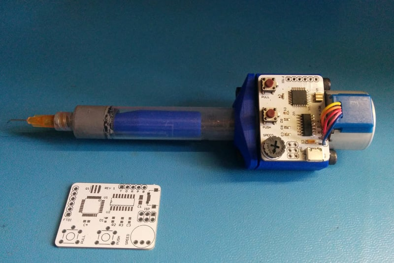
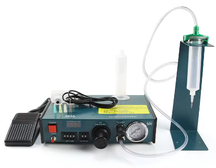
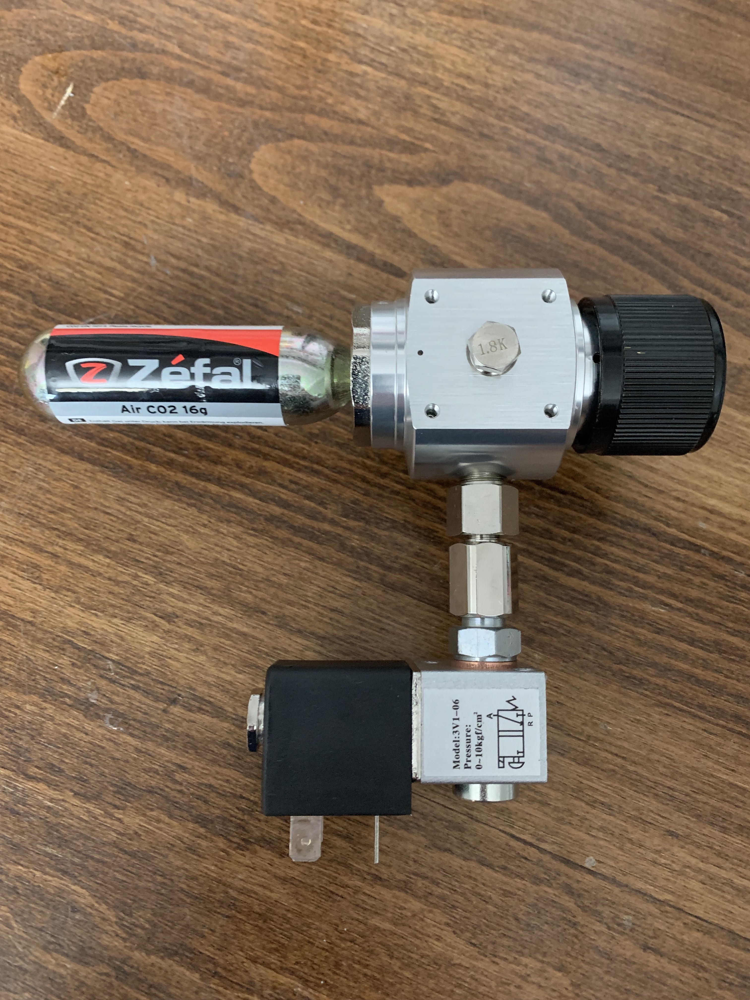
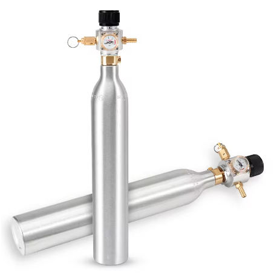
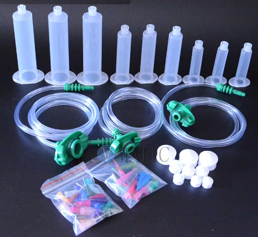
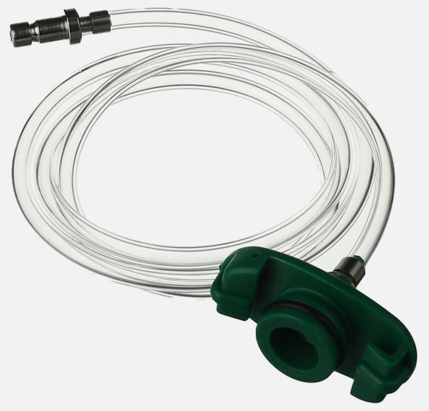
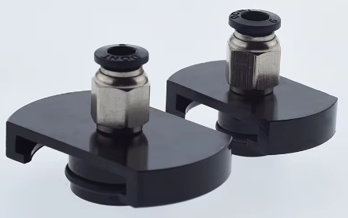
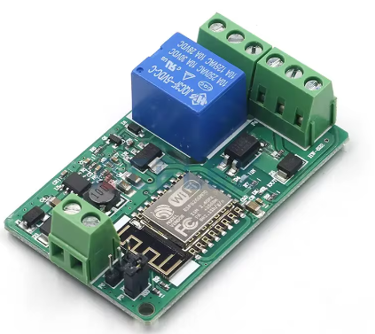

Further to, ...

https://organicmonkeymotion.wordpress.com/2024/08/02/ive-been-soo-bad/

Link 1

Recapping an option for solder paste dispensing was a stepper "extruder", namely that in Figure 1.

Figure 1

Now, the other option is a pnematic setup, often represented by something like in Figure 2.

Figure 2

So that's between AUS$66 and AUS$100 (dependant upon reliance or not on price drops during sales, and somewhat the new Aliexpress v Temu battle). The missing story behind this option is you need a compressor, and probably something with an accumulator to try and stabilise the air. In some cases, small compressors are, I want to say, 9L in capacity generally. Though down to, say, 3.5 litre for an air brush compressor. Regardless, additional cost and bench or other space.

Now the thing with the pneumatic setup at Figure 2, even if you stole the switch input, driving it with a relay, you still have to manually adjust the time.

Hmm, ChatGPT says you need, for solder paste dispensing, a range of pressures upwards of 100psi.

So that accounts for this at Link 2.

https://hackaday.com/2021/11/26/solder-paste-dispenser-without-giant-compressor/

Link 2

You can buy that for $$$ at: <https://makerstorage.com/index.php?id_product=37&controller=product>

Inside of that is at Figure 3.

Figure 3

But Aliexpress saves the day with for $ and not $$$, with something like Figure 4.

Figure 4

So with a pneumatic value and a kit of dispensor syringes, we could have something that doesn't take up $$$ nor space, and could control (at least) dispense time via computer control.

The nuisance factor being, the Australian standard valves for SodaStream bottles typically use a thread type known as 21-6.58, also referred to as G 5/8" BSP (British Standard Pipe). This is a common thread type for gas cylinders, including those used for carbon dioxide (CO2) in beverage carbonation systems.

The regulators from Aliexpress cite T214. A bit of research and one finds adaptors from T214 to W21.8-14. T214 and W21.8-14 are specific thread standards used for gas cylinders. Here's a brief explanation of each:

1. **T214**: This refers to a specific thread type used for CO2 gas cylinders. The designation "T214" is often associated with the SodaStream CO2 cylinder valve threads. It ensures compatibility with the SodaStream systems.
2. **W21.8-14 (W21.8 x 1/14)**: This is a thread specification commonly used in Europe and some other regions for CO2 gas cylinders. It indicates a thread with a diameter of 21.8 mm and a thread pitch of 1.814 mm. It is sometimes used interchangeably with the G 5/8" BSP thread, but they are not always identical and may require adapters for cross-compatibility.

T214 and 21-6.58 (also referred to as G 5/8" BSP) are generally considered compatible as they both describe the same thread type used in various regions for CO2 gas cylinders, including those used in SodaStream systems.

However, there might be some regional variations or specific implementations that could cause slight differences. In most cases, they should be interchangeable, but always double-check with the manufacturer or refer to specific product specifications to ensure compatibility.

I may or may not need an adaptor. Let's find out.

Speaking of adaptors, Figure 5 is the Aliexpress kit I was thinking about, BUT what on earth are the connectors for the air source!?

Figure 5

An alternative is Figure 6.

Figure 6

That looks like a "quick release", but does that fit the standard quick release widgets we know and luv? It almost looks like what is called an "airbrush quick release"?

Then there's Figure 7.

Figure 7

Which means, probably, something straight forward. As I assume then these connectors, that I have also used in my PnP vacumm system, as likely should be fine blowing and not sucking, as it were. What? Double entendre? Cancel me.

The controller board could be as simple as Figure 8.

Figure 8

First pass pricing.

|  |  |  |  |
| --- | --- | --- | --- |
| Item | Figure | Description | Approx Cost (B4 shipping) |
| 1 | 4 | [Regulator (sans bottle)](https://www.aliexpress.com/item/1005005969185837.html?spm=a2g0o.detail.0.0.774fxJyxxJyxQS&mp=1) (sans blow off 85psi valve) | AUS$49 |
| 2 | - | [12V Solenoid Valve](https://www.aliexpress.com/item/1005005553332065.html?spm=a2g0o.detail.0.0.4c00L9RJL9RJtp&mp=1) | AUS$12 |
| 3 | 9 | [ESP8266 relay board with 7-30VDC input](https://www.aliexpress.com/item/1005004913866496.html?src=google&src=google&albch=shopping&acnt=708-803-3821&isdl=y&slnk=&plac=&mtctp=&albbt=Google_7_shopping&aff_platform=google&aff_short_key=UneMJZVf&gclsrc=aw.ds&&albagn=888888&&ds_e_adid=&ds_e_matchtype=&ds_e_device=c&ds_e_network=x&ds_e_product_group_id=&ds_e_product_id=en1005004913866496&ds_e_product_merchant_id=658918223&ds_e_product_country=AU&ds_e_product_language=en&ds_e_product_channel=online&ds_e_product_store_id=&ds_url_v=2&albcp=19374042898&albag=&isSmbAutoCall=false&needSmbHouyi=false&gad_source=1&gclid=CjwKCAjw2dG1BhB4EiwA998cqPJs85azbfgXF3dpennfpJ2BfG2gy9AuZaPe8LN6ScuzuAIC_OWp8hoCALcQAvD_BwE#nav-description) (makes sense for 12V solenoid valve version) | AUS$4 |
| 4 | - | Sundries (hoses, connectors) | (not included) |
|  |  | **Total (before controller board)** | **$81** |

So, about the same price (on average) as the desk unit at Figure 2, except for the "missing" additonal approx AUS$200 for the compressor required on top of the desk unit at Figure 2. Let's also not forget that the USD$189 of the unit at Link 2 is AUD$287.

Let's have at it then! This could (and probably will) be used both on the solder paste robot, and provide a manual paste option for the manual PnP machines I made, as well as probably a not bad hand held solder paste option.

Nice to have options.
