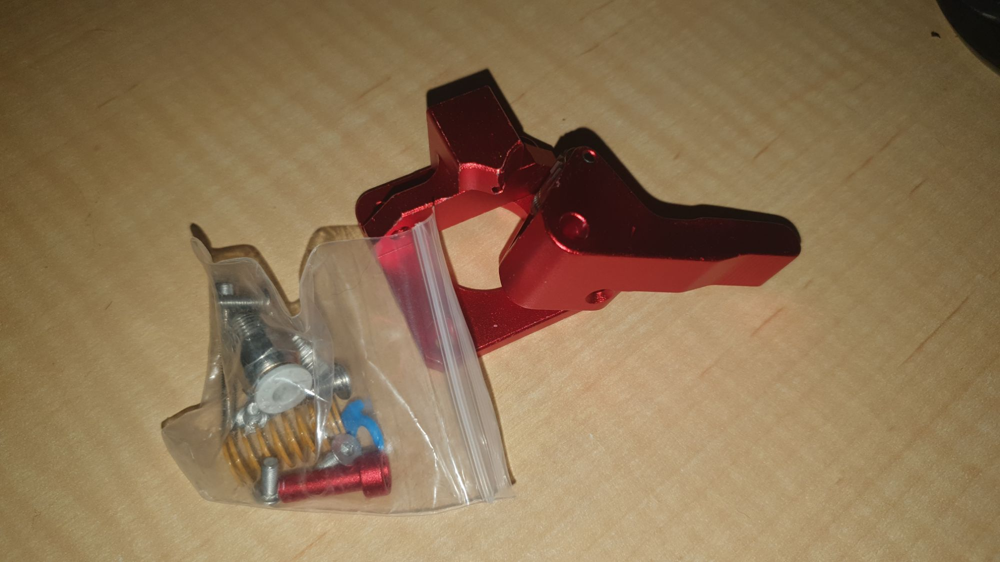

AUS$6

So, the bits for the solder paste robot are coming together.

I also had, in my mind, a fitting for a soldering iron. That needs a solder "pusher", and I thought a filament feeder might come close to doing the job.

The hindrance, if you're wanting to get in under the horizon of the $$$, many filament feeders were $$. Designing and 3D printing something is an option, but AUS$6!

The only problem is solder may be 1mm diameter, whilst filament is 1.75mm. So, maybe a little 3D modelling.

Although, I just ordered knurled pinions from Robodigg. On sale of course. If they don't work in practice, they should work in principle. Meaning, now I have the idea, I could probably machined pinions, with knurling, on a lathe.
