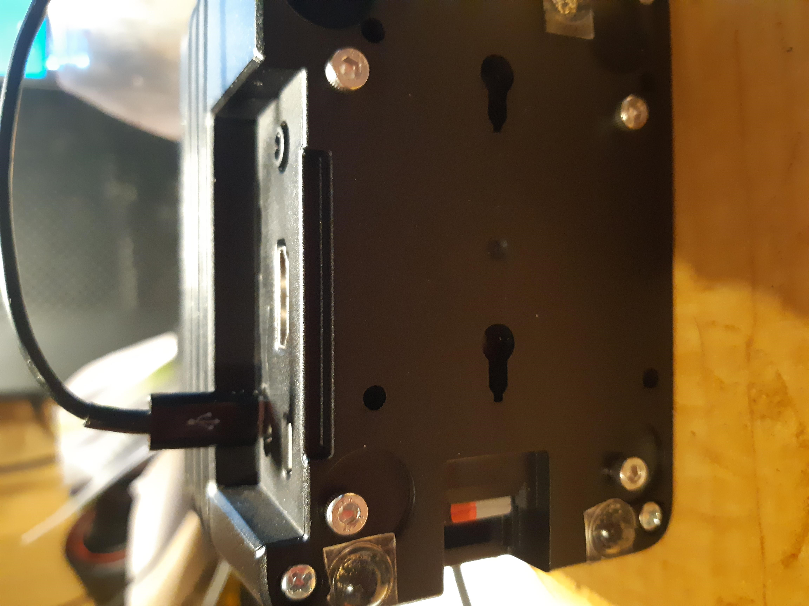
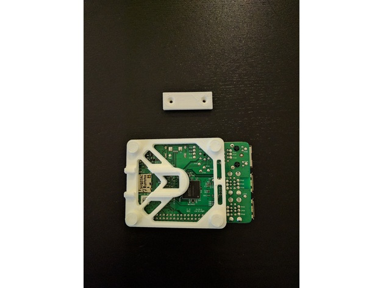

So, I was wanting to box my clusterHAT setup. A few options around, but I settled on a [modular box](https://core-electronics.com.au/modmypi-modular-rpi-2-3-case-black.html) that I sourced from Core Electronics. I bought 4 spacers, just in case, but you can only get up to 58mm screws for 3 spacers.

Notice the nylon feet that the RPi is standing on? Notice the screws in base below? The feet would go as there were 4 seats on the bottom of the case that lined up with the feet locations. I had to drill out the seats with a 3mm drill as I needed to pass screws through the case bottom, through the thickness of the RPi board and into the spacers on the top of the RPi board.

The other mod, not obvious here, as there was a circular hole in the case more or less inline with the micro-usb connection on the clusterHAT. A round hole obviously the wrong shape for the micro-usb so a little work with a file opened that up (which you can tell because of the micro-usb cable inserted above).

So, the problem is that the depressions in the base of the case, really to take stuck on rubber feet, were sited in just the right place to cause a problem. The seating holes turning up in the seat for the rubber feet.

The small feet I am using came with the clusterHAT kit. They are high enough to clear the hex screw heads.

Probably moot as I decided to 3D print a bracket to hang this on the shelf on my desk. No need to design one as I found the [perfect bracket](https://www.thingiverse.com/thing:2085090) on thingiverse by [yazgazan](https://www.thingiverse.com/yazgazan/designs).

The design above will need a little rework. I will need longer screws to screw this on the back of the case, so 3mm hole. But, also wik will be a recess for the screw heads, since they will be otherwise in the way. Since the white posts are supposed to sit flush on the surface the holder is against.

Minor changes that I will post on my scant offerings on thingiverse, once I make the changes.
