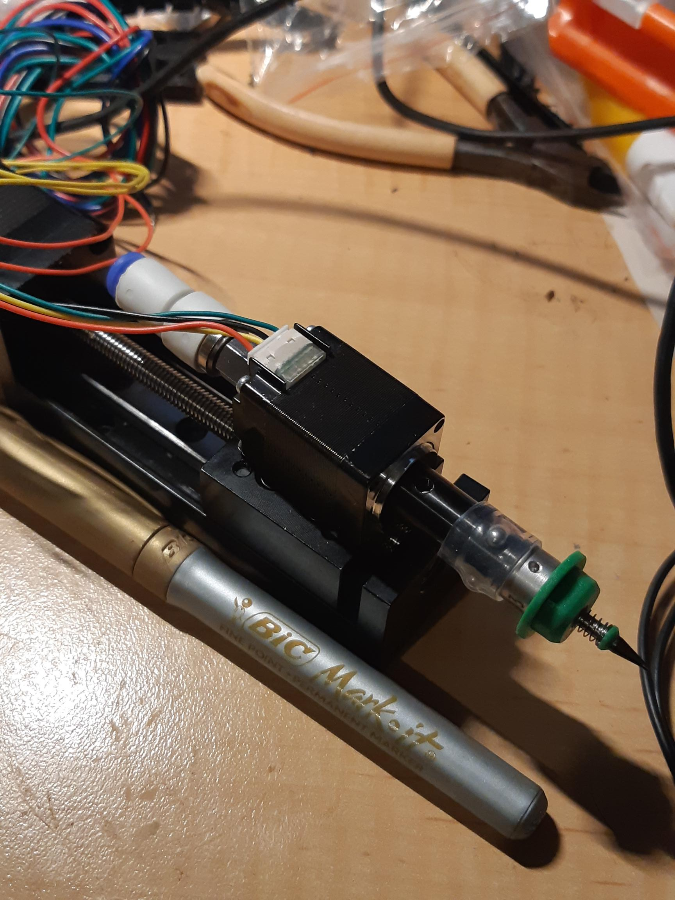

Figure 1

So, Figure 1 is the Nema8 Hollow Shaft Stepper motor with the accoutrements of pneumatic hose connection, nozzle holder and a nozzle, [dropped onto the tiny 50mm travel Z-axis](https://organicmonkeymotion.wordpress.com/2021/11/01/what-a-great-little-piece-of-machined-heavon/).

That inspires me to push onto finishing the design of the X/Z carriages, as I have all the extrusions, linear rods, LM8LUU bearings etc. I am, however, waiting on an order of all the hardware (hex screws and button heads), which I hope will be here for Christmas so I can do a build.

UPDATE!

Even better. My parcel locker was pummelled later in the week by multiple items. Things including the hardware order for the corexy PnP build (various M3, M4 and M5 hardware). M3 heat inserts (I have a second order of M2 and M4 coming). So, not many excuses to hold off the next sprint on the design/build.
