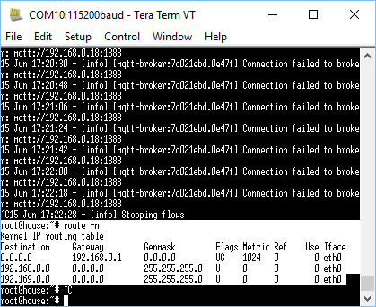

...weird!
So, story up to this point was again I added the expansion board to my OPiZ.  That fragged the board somehow so that it had the weird side effect of not booting orangepi.org version of Debian server but happily still booted armbian.ord distro of Debian server.
Weird because orange.pi Debian server is derived (I think) from armbian.org's distro (at some point).
Weird because orangepi.org distro booted happily before fragging by inserting expansion board.  Weird because even if you took the expansion board out orange.pi distro would not boot from OPiZ any more.
Weider again was that once the expansion board fragged the baseboard, the armbian.org distro could not be set with a static IP via nmtui on the OPiZ.  That was because, after fragging, nmtui would hang the armbian.org distro whenever you tried going to the connections page.
Weird because you could happily set the hostname using nmtui??!!
So, go figure.  I thought to try nmcli.
From examples on internet it should have gone something like (for my setup at least):

```
root@house:~# nmcli con edit 'Wired connection 1'
nmcli> set ipv4.method manual
nmcli> set ipv4.addresses 192.169.0.100/24
nmcli> set ipv4.gateway 192.168.0.1
nmcli> set ipv4.dns 61.9.226.33 61.9.226.1 8.8.8.8 8.8.8.4
nmcli> save
nmcli> quit
root@house:~#
```

However, quirk of Armbian is that there is no ipv4.gateway property.  Without it I had set up a static IP but could not get out to internet (no gateway).
I came across a probable back door route with the following;

```
root@house:~# nano /etc/network/if-up.d/gwconfig
```

```
#!/bin/sh

if [ "$IFACE" = "eth0" ]; then
 route add default gw 192.168.0.1
fi
```

```
root@house:~# chmod a+x /etc/network/if-up.d/gwconfig
```

You can then just reboot and then every time you boot "route add default" sets your gateway.
Except in Armbian, of course, that route command does not work with those parameters!
DOOOOOOOOOOOOOOOOOOOOOOOOOOOOOOOOOOOooooooohhhh!
However, while the help file never said "gateway" there was some discussion in the help for nmcli on "addresses", and in other places, that talked about "hops".
So, AH HA moment (reaching back to that neuron containing networking 101).
So it turned out the fix was not obvious but is:

```
root@house:~# nmcli con edit 'Wired connection 1'
nmcli> set ipv4.method manual
nmcli> set ipv4.addresses 192.168.0.100/24 192.168.0.1
nmcli> set ipv4.dns 61.9.226.33 61.9.226.1 8.8.8.8 8.8.8.4
nmcli> save
nmcli> quit
root@house:~#
```

Notice the gateway is set in address now after the static IP for the OPiZ.
To check this you can use with "route -n", you should see something like:

The garbage preceding it is the node-red shutdown down - sweet.
So, now I have static IP setup on my OPiZ - not the happiest route ... ha ha ... get it?
Now all I have to do is sort the stupid node-red and emqttd problem where, despite quite straight forward steps, neither will start for me as services.  That is the next step as discussed I want the OPiZ to start up with things a blazing.  Although, there might be a backdoor route through startup scripts.
