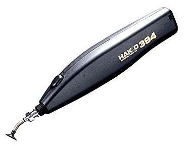

I tried a fiddly practice smd practice board, with tweezers and god awful process it was.

I was practicing before assembling my hand held solder paste dispenser. I want to do that to use that for assembling the version that will sit in the manual PnP.

Got my tax check in, so ordered a Hakko 394-01 to help with fiddly small jobs that won't make sense setting up in the manual PnP - and so not needing to use fiddly tweezers.

Battery operated vacuum pick and placer

It comes with a couple of "fatter" nozzles but I contacted the vendor who had the optional needle nozzles in the warehouse but not listed on their website. Bonus.
