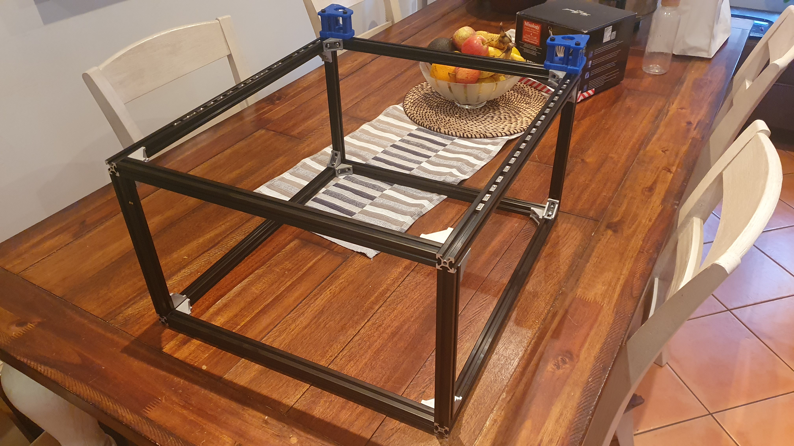
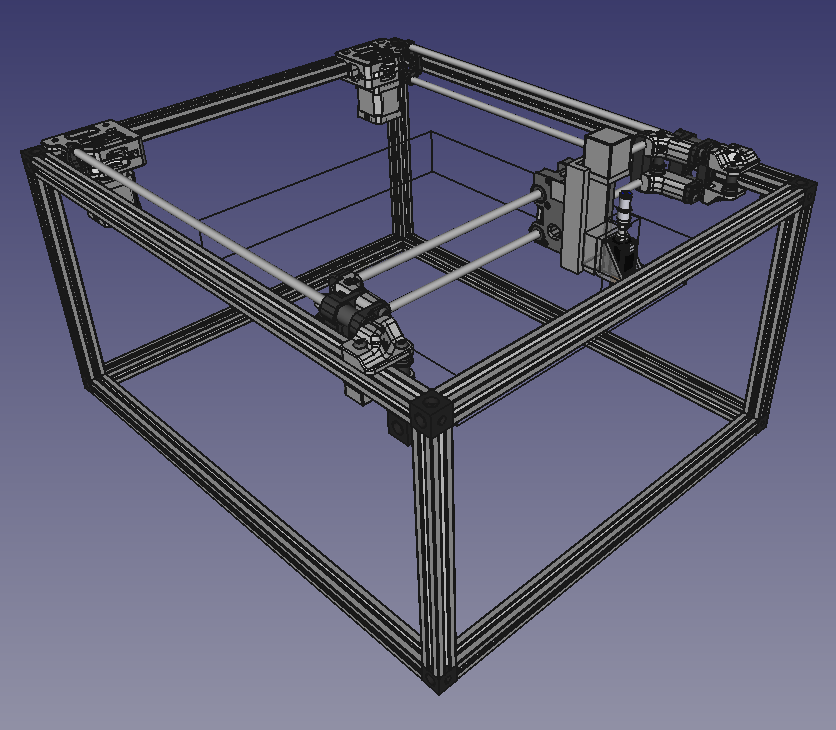

Not bad for 4 hours at the maker space!

Now you should have noticed I did opt out of the [Voron Legacy](https://vorondesign.com/voron_legacy) style corexy, for the [Mercury One.1](https://docs.zerog.one/manual/build/mercury_eva) by ZeroG. A slightly different assembly approach, given the different mounting style of the motor mounts. A greater working area using the Mercury One.1 approach.

