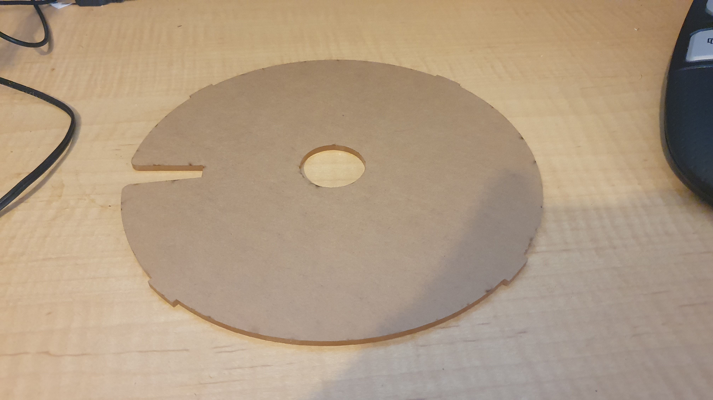

So I dug around to find a means to manage assembly of small and also small run surface mount projects, especially when using me Hakko 394.

https://www.youtube.com/watch?v=q9AA8I2TsJs

You remember me Hakko 394?

Paired met the following, fantastisch!

https://www.youtube.com/watch?v=scHSrFdWn5k

What a neat idea! Good job Unexpected Maker!

At the mo, I have the parts tray a printing in ABS light blue at the [Makerspace](https://makerspaceadelaide.org/).

So while the print bedded down, and before I left it for its 7 hour journey, I tried my hand at laser cutting the 3mm perspex lid. The bearings are in Australia, from Aliexpress, so a couple more prints and then assembly.

Itching now to try out that [reflow oven at the makerspace](https://organicmonkeymotion.wordpress.com/2023/09/23/wow-6/).

Go figure, couldn't help meself, had to update the design of the base so as to keep the lid on.

https://www.youtube.com/watch?v=UGpfvA\_wF9o

Gory details in a [GITHUB issue](https://github.com/UnexpectedMaker/manual_pnp_turntable/issues/15) I added to the source repository. What I hope are final draft options are at [Thingiverse](https://www.thingiverse.com/thing:6310146).
