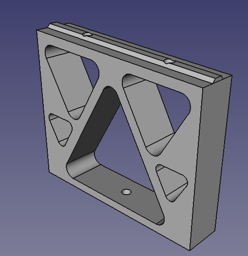

So, given I had to lift the x-gantry up to 80mm, I have updated the stanchions from Figure 1 to Figure 2.

Figure 1 - 60mm tall

Figure 2 - 81mm tall

Noting this was designed to fit T-Slot extrusions. The second is 81mm since I have raise the bed by 1mm, since I am using a 1mm thick steel sheet, so as to allow for magnets to "stick" to the working surface.
