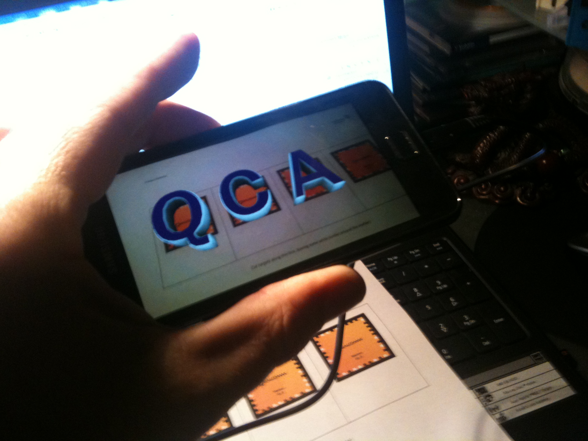

So, a little trouble getting the Framemarkers demo working from the QualCOMM AR (Artificial Reality) toolset.
However, turned out with a little reading of the log and the use of the debugger it was as simple as the jar not being in the build path - easily fixed.

Now what application does this have in my robotics experiments?  Have a look at [Stargazer](http://www.robotshop.com/hagisonic-stargazer-localization-system-3.html "Robot localisation").
So, ID tags on ceilings and software to triangulate.
Well, what I was thinking about is integrating the Framemarker detection with a monocular SLAM (google "monocular SLAM" or "monocular visual odometry").
Yes, a sort of a cheat in place of the feature detection and possibly even superior if I play with including the physical locations of the tags - SLAM works relative to features rather than absolute (generally).
Regardless, not a bad little experiment to train up on NDK, Android, SLAM and AR.
