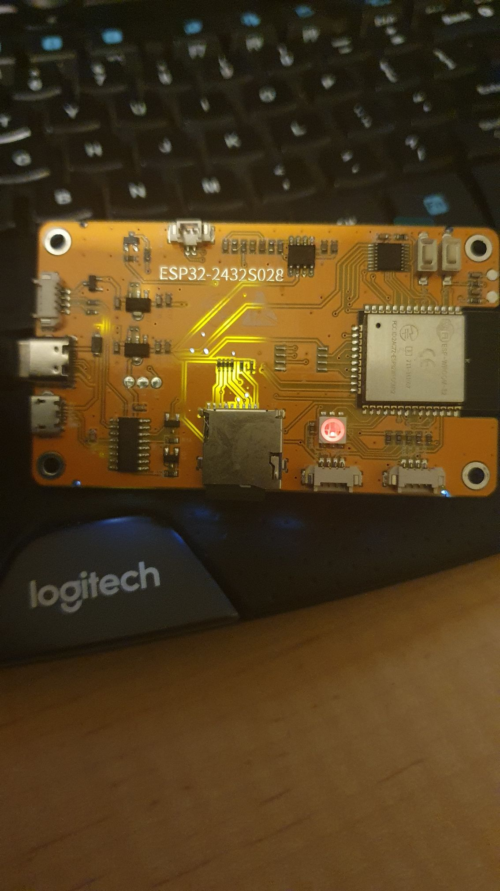
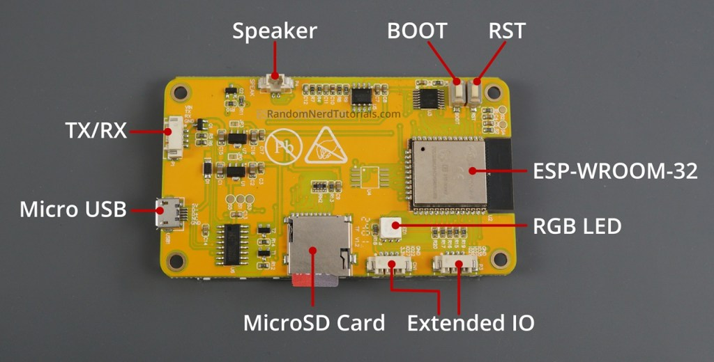
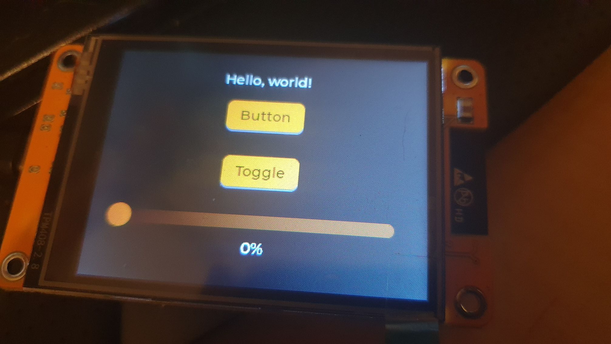
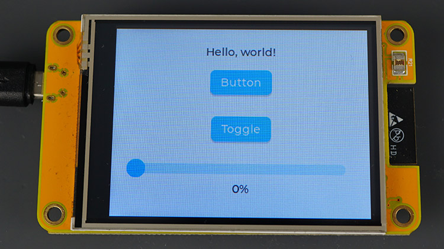
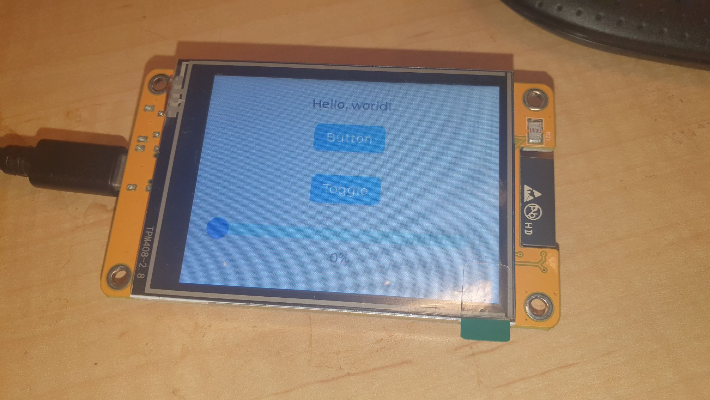

Starting with the following:


https://randomnerdtutorials.com/lvgl-cheap-yellow-display-esp32-2432s028r/


Why? With all the clones aboot, I was weary that the example would need be hacked to get it up, if the board pins did not align etc., given the pic below is the board I have, ...


[](./20241022_2132186078532545955996460.jpg)


..., versus the one at Random Nerds, being (apparently) also a ESP32-2432S028R:


[](./esp32-cheap-yellow-display-cyd-board-esp32-2432s028r-back-labeled.jpg)


So now the pain.


* Having already bombed the board with "Hello World" from the distro [here](https://github.com/witnessmenow/ESP32-Cheap-Yellow-Display/tree/main), in mscode, running on my trusty old HP Spectre x360 laptop.
* Decided, since I finally got around to re-building my [MonstaPC](https://organicmonkeymotion.wordpress.com/category/monsta-pc-build/) with the cooler MSI sent to replace the fragged cooler due to that relatively recent recall 😉, I would move the ESP development to Ubuntu on the MonstaPC.
* Installed mscode and then went to setup platformio. No findy python. Tried telling it EXACTLY where python was. No findy python. Re-istalled python. Cracked up half way through setting up espressive sdk. 😒
* Jumped back onto trusty old HP Spectre x360.
* In the Random Nerd tutorial, the example was setting up the code using Arduino IDE (yes I did try that on Ubuntu, using the appimage and ditched that).


Eventually, I got the following, ...





Wafer thin changes to main.cpp, being:


* Add `#include <Wire.h>` at the top of the file (really after the inaugural comment header).
* Use `XPT2046_Touchscreen_TT` and not `XPT2046_Touchscreen` as that `XPT2046_Touchscreen` library by Paul Stoffregen is still at 0.0.0-alpha in platformio for some dang reason (it is 1.4 in the example and as the latest release at time of posting). Some other dude has the code `XPT2046_Touchscreen_TT`, not forked, but probably copy-pasted from `XPT2046_Touchscreen`, and with hacks (for some other dang reason). The alternate code versions start at 1.5 so reads Stoffregen's 1.4+ (probably). BUT it works! Note `XPT2046_Touchscreen_TT` is pulled in via platformio libraries as was `XPT2046_Touchscreen`.


Then there is the platform.ini which needs to look thus:


```
[env:esp32dev]
platform = espressif32
board = esp32dev // that is Espressif ESP32 Dev Module
framework = arduino
lib_deps = 
	bodmer/TFT_eSPI@^2.5.43
	tedtoal/XPT2046_Touchscreen_TT@^1.7.1
	lvgl/lvgl@^9.2.0
	adafruit/Adafruit GFX Library@^1.11.11
	adafruit/Adafruit BusIO@^1.16.1
```


The one issue I need look into is the colours. Given the Random Nerd tutorial has a screen colourised thus:


[](./esp32-cheap-yellow-display-board-cyd-tft-display-touchscreen-lvgl-library-example.jpg)


So, looks like a colour palette thing and a backlighting thing (probably). Could be that it's because I am using `XPT2046_Touchscreen_TT` and not `XPT2046_Touchscreen`? Will see.


**UPDATE**


Well, the source webpage did actually have chatter about the coloure problem versus the boards sans "R" (or arrrrgghhh!).


Someone helpfull suggested we add a definition thus:


```
TFT_eSPI tft = TFT_eSPI();
```


And then the following in `setup()`:


```
tft.invertDisplay(1);// this changes the color assignment
```


BUT!


No hint where that line of code need to go inside of `setup()`. A bit of fiddling and a little critical thinking and I worked out it needed to go after the screen creation, so:


```
void setup() {

  ...
 // Create a display object
  lv_display_t * disp;
  // Initialize the TFT display using the TFT_eSPI library
  disp = lv_tft_espi_create( ...
  lv_display_set_rotation(disp, LV_DISPLAY_ROTATION_270);
  tft.invertDisplay(1);// this changes the color assignment
  ...
}
```


Odd. There seem to be "invert" functions in LVGL library but, go figure, you create an TFT\_eSPI object separately, but surely the LVGL library has a function that sets up the graphics and probably buries something somehow? Not enough in the comments in the code of any library to work this interaction out.


Clumbsy but, there you go. It works. See:


[](./wp-17299228167273665971437772837354-1869627483-e1729924788856.jpg)


Hence, oddly, the sans "R" (aka noaarrggghhh!) version appears to have the display inverted (for some danged reason) over the "R" (aka aaaarrgggghhh!) version.
