Okay, so the wiring for the zoom/focus lens' I bought, for my animatronics play, has the wiring colouring at Figure 1. The shop I bought them from had naught on the wiring, but since the web "market" is full of the same junk, different vendor, I lucked into the data at Figures 2 and 3.

The initial thought was a purpose built board based upon the [micro-stepper](https://github.com/kadeturn/Micro-Stepper) and therefore the [TMC 2300](https://www.analog.com/media/en/technical-documentation/data-sheets/TMC2300_datasheet_rev1.08.pdf).

[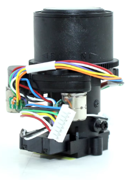](./lens-steppers.png)

Figure 1: The camera lens with 8mm zoom and focus motors

In the meantime, I've a CNC Shield V3.0 sitting on a Wemos D1 R32 that I seem to have successfully got a [ESP32 version of grbl](https://github.com/bdring/Grbl_Esp32) bombed into its tiny little brain (although do I want to upgrade to [FluidNC](https://github.com/bdring/FluidNC)?). Might also just drive straight from code, though there is a l[ibrary that assumes the mode pins are connected](https://github.com/pranav083/Stepper_STSPIN220-library) to the MCU, that may need fiddling with to go without MCU of the mode pins. Do does this [code](https://github.com/Humanoiid/Arduino-Motordriver-Stepper).

Any old how.

The volts'll need be watched, so would the amps. Maker Store has a great guide on the [CNC Shield V3.0](https://www.makerstore.com.au/wp-content/uploads/filebase/publications/CNC-Shield-Guide-v1.0.pdf?srsltid=AfmBOoqfGScSgNNq1QBOHoXJJl0lOx2zAUDNt-LZw89E5sKncdiJDW3M).

The voltage in Figure 2 is only 4V, so that looks like I probably need a [STSPIN220 Low-Voltage Stepper Motor Driver Carrier](https://www.pololu.com/product/2877/specs). With pinouts at Figure 4, compared to one of the drivers usually recommended being, namely a [A4988](https://www.pololu.com/product/2985) at Figure 5. The A4988 need too many ergs. The schematic for the [STSPIN220](https://www.st.com/resource/en/datasheet/stspin220.pdf) breakout being at Figure 6. Looks like the actual pins of the two chips are mapped according to the table below.

|  |  |  |  |  |
| --- | --- | --- | --- | --- |
| A4988 | OUT1A | OUT1B | OUT2A | OUT2B |
| STSPIN220 | OUTA1 | OUTA2 | OUTB1 | OUTB2 |

And wild right! You can even get a step file of the STSPN220 breakout to play with, see Figure 7.

First problem, what is the voltage going to VCC of the driver breakout, from the CNC Shield V3.0.

Sweet! Figure 8 seems to suggest that the drivers get 5v to their VCC (okay VDD) pins. Won't know unless I try, so I'll order a carrier from Core Electronics and I've got a packet of 8-pin JST SH 1.0mm connectors, so I can design a breakout to connect to the 2.54mm pins on the CNC Shield 3.0.

Figure 8 shows the mapping of driver pins to motors and thence onto host board pins. Figure 8 has the schematic as a 2B/2A/1A/1B flavour matching the A4988 breakouts as opposed to our B1/B2/A2/A1 of the STSPN220. So, this again is the problem with stepper motor providers not even able to agree within and between themselves which output is named what or even if those pins have the same connection idiom between chips of the same manufacturer. I mean the TMC22xx and TMC2130 from Analog devices have their A pins swapped with respect to the generic stepper symbol in the data sheets. You note also that issue is not resolved since Analog Devices support never did respond to my support ticket. Hence a Potty Award for Analog Devices support, well done losers for dumping on the little people.

Motor volts on the CNC Shield 3.0 apparently can come from the EXT-V IN terminal, ignoring the "12-35V", since that's assuming the usual NEMA 17 odd steppers you might attach to this if yawl actually using for a CNC machine. The way it's wired though, their is no hinderance using lower voltages, since it's just a pass through. Pins utilisation on the arduino header for the CNC Shield 3.0 are at Figure 9. Of course, we have to have yet another idiom for the stepper symbol in the stepper driver space, see Figure 10.

If that all works out, and I hope it does, as I've got 20 STSPN220 coming from Aliexpress, since they turn out to come in 20's when I can buy 1 TMC 2300. So, I can sort out the locomotion with the CNC Shield 3.0 and co, and get things animatronicing whilst working on a purposed built board in the background. Those STSPN220 are for the purpose built board I will design. I've a few STSPN220 [breakouts coming from Core-Electronics for the prototyping](https://core-electronics.com.au/stspin220-low-voltage-stepper-motor-driver-carrier-header-pins-soldered.html), so that'll need a patch board to marry the camera wiring to the CNC Shield 3.0.

Given these micro steppers are also driving gear boxes, and there's no need for finesse here, I'll just set the drivers to full step, simply driving all direction/step outputs to "O", before enabling the steppers, with Mode 1/Mode 2 pins also bottomed out. In fact, and probably mercifully, if you set MODE 1 and MODE 2 to zero, on powerup [the chip ignores MODE 3(STEP) and MODE 4 (DIR) inputs](///home/asterion/Downloads/an4923-stspin220-stepmode-selection-and-onthefly-switching-to-fullstep-stmicroelectronics.pdf) (see heading 2.2 of the doc at the link).

Starting prototype of a jumper hack, between the CNC Shield 3.0 and the camera, thus at Figure 11. The schematic of the prototype PCB is at Figure 12. Board exported to PCBWay using the nifty "[PCBWay Plug-In for KiCAD](https://www.pcbway.com/blog/News/PCBWay_Plug_In_for_KiCad_3ea6219c.html)".

[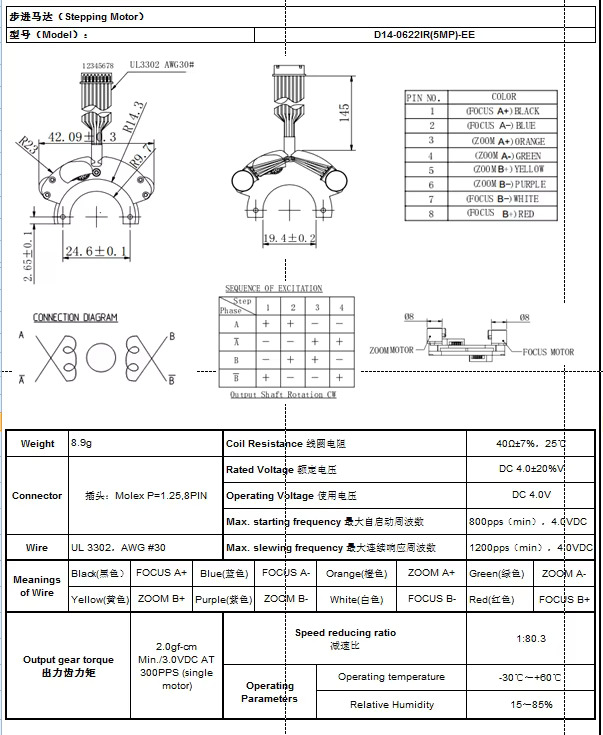](./s5296e7f5acf44a18b7ceb12547c56a54w.jpg)

Figure 2: Data sheet 1 for lens

[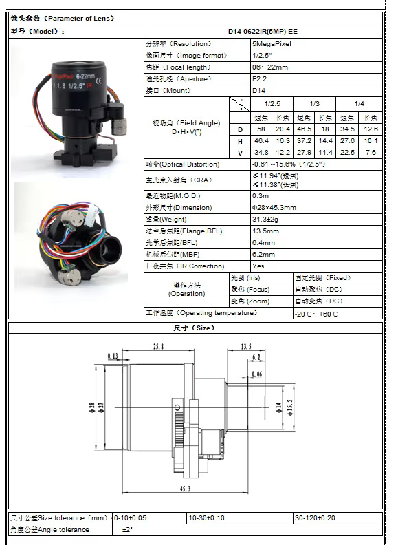](./sa5662fe199b7437db3e326af83a21b2dd.jpg)

Figure 3: Data sheet 2 for lens

[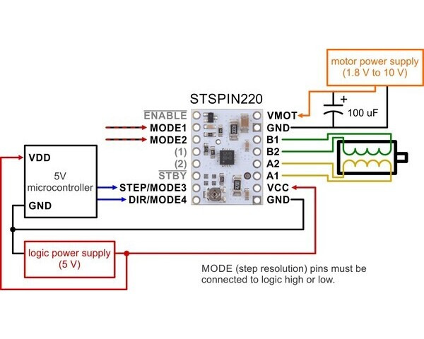](./0j9750.600x480.jpg)

Figure 4: The STSPIN220 breakout

[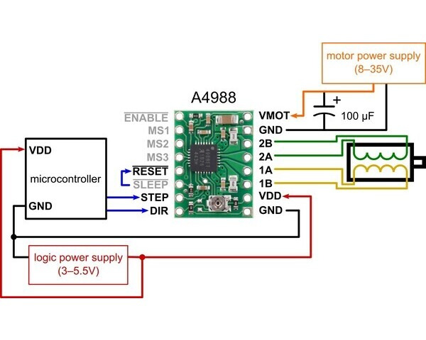](./0j10073.600x480.jpg)

Figure 5: The A4988 breakout for comparison

[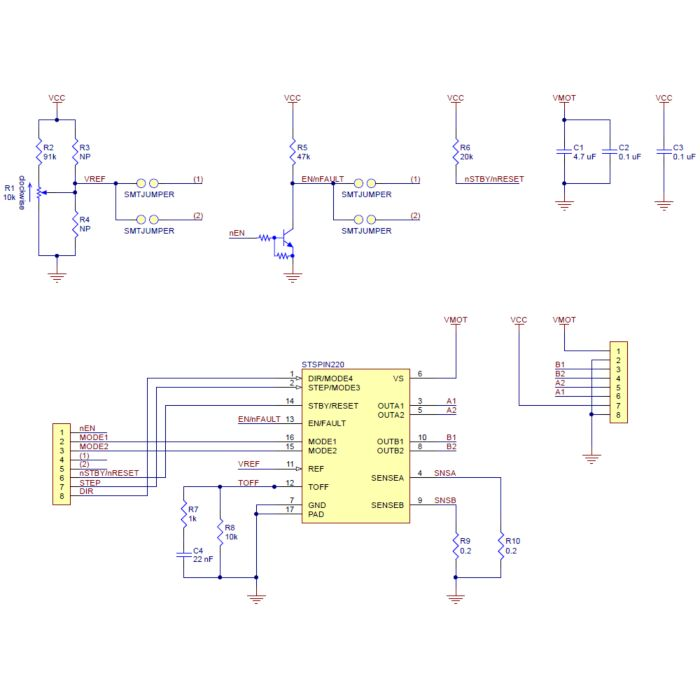](./image_5856.jpg)

Figure 6: The STSPIN220 schematic

[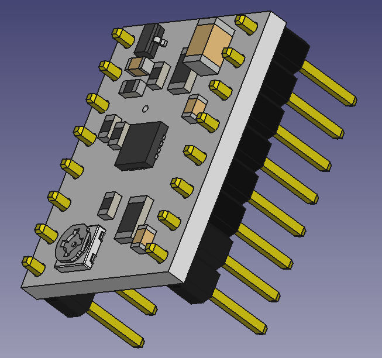](./220-breakout.png)

Figure 7: The STSPIN220 3D model

[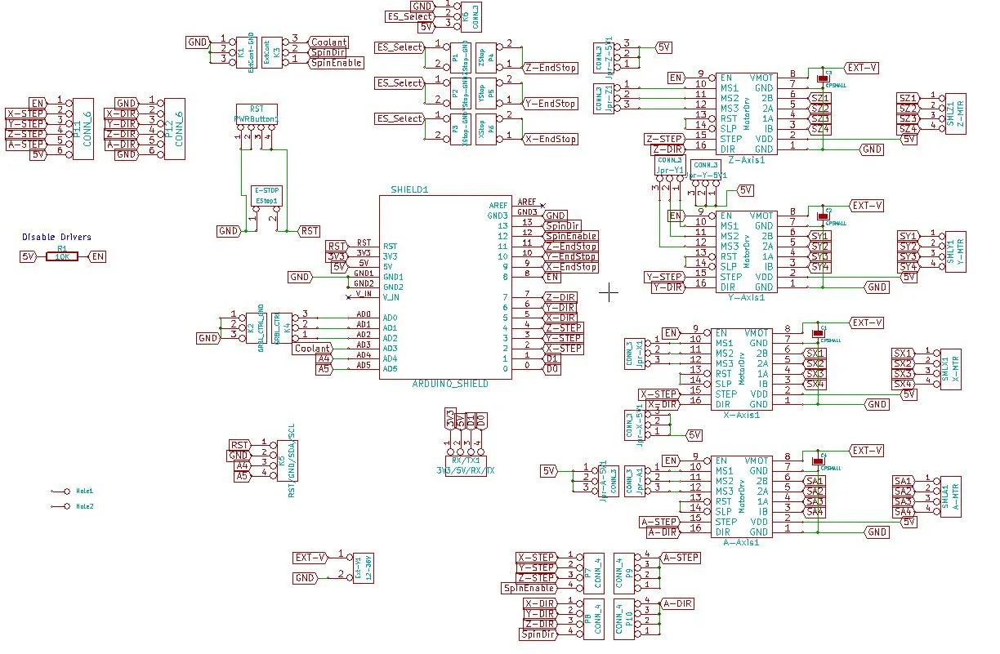](./arduino-cnc-shield-scematics-v3.xx_-ezgif.com-webp-to-jpg-converter.jpg)

Figure 8: The CNC Shield 3.0 schematic

[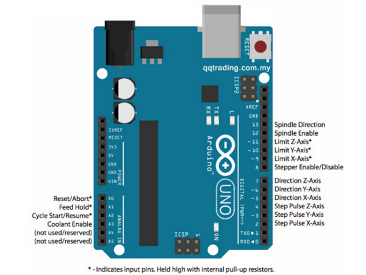](./pinout.png)

Figure 9: The CNC Shield 3.0 pin-outs

[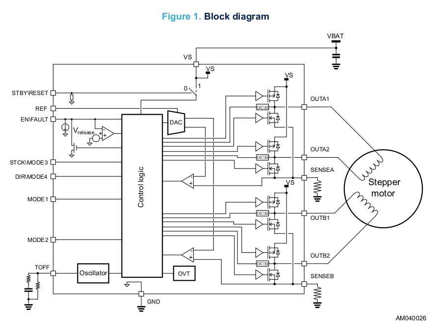](./screenshot_2024-11-23_15-11-05.png)

Figure 10: The STSPIN220 schematic from data sheet

[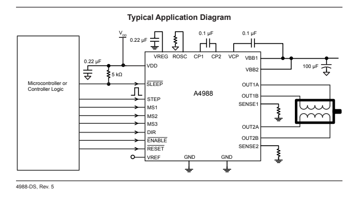](./a4988-schematic.png)

Figure 11: The A4988 schematic from data sheet

[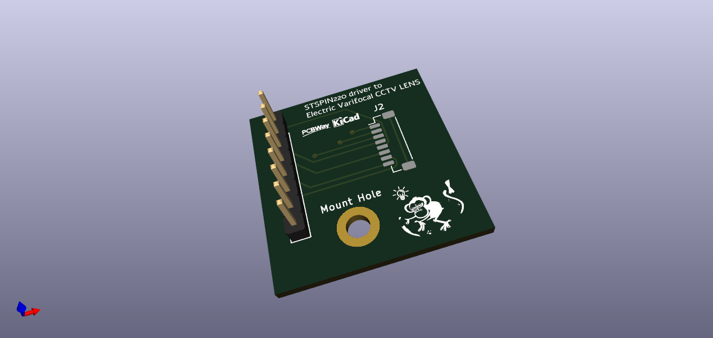](./mico_stepper_jumper_hack.png)

Figure 11: Version 0.1 of the CNC Shield 3.0 to lens patch panel

[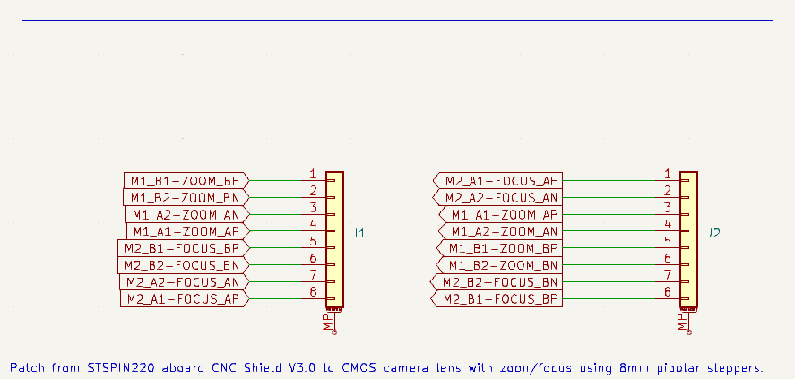](./schematic-for-patch.png)

Figure 12: Version 0.1 of the CNC Shield 3.0 to lens patch panel

**UPDATE**

Hang on I have to swap a couple of pins, but having done so, simply by changing the last characters onf the left (N->P, and P->N), this broke KiCAD and the netlist update on the PCB. So, I have to do the PCB again.

**UPDATE**

Worked out I should have simply used net labels and not global and to keep it simple I used text labelling to name pins and then dumbed down the net names. Hence Figure 13. This assumes (hopefull) this is all sorted wit the table below. Frack knows why there can't be some single standard for pins and coils labeling and symbols. Final rendered 0.2 prototype, at FIgure 14, now in cart at PCB Way.

Figure 15 is just a what-if using the [KiKit Panelizer](https://github.com/yaqwsx/KiKit), although the 3D render does not know how to show up the v-cuts.

|  |  |  |  |  |
| --- | --- | --- | --- | --- |
| A4988 | OUT1A | OUT1B | OUT2A | OUT2B |
| STSPIN220 | OUTA1 | OUTA2 | OUTB1 | OUTB2 |
| COIL | A+ | A- | B+ | B- |

[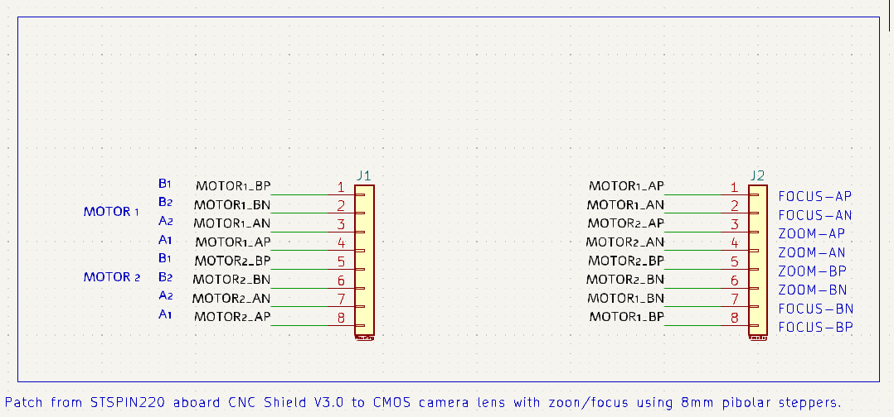](./final-schematic.png)

Figure 13: Version 0.2 schematic

[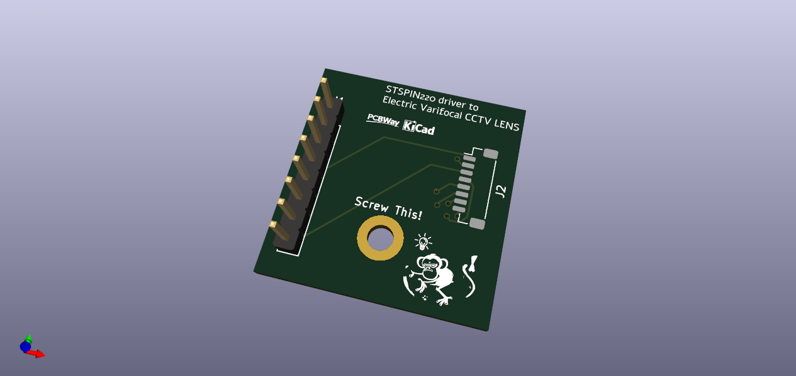](./final-3d-render-1.png)

Figure 14: Version 0.2 render in KiCAD

[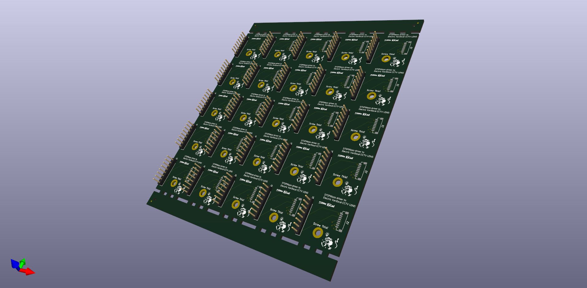](./3d-render-of-panel.png)

Figure 15: Some fun with KiKit Panelizer

**UPDATE**

[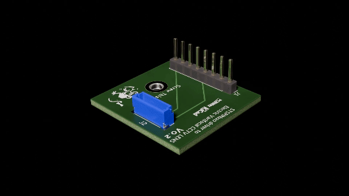](./board10001-0360.gif)

Figure 16: Now that's what I'm talking about!

Oh! Oh! Tidied a few things up AND found that pesky 3D model for the JST SH 1mm 8-pin connector at the JST site no less, hence Figure 16, using [a neat KiCAD to blender exporter thingy](https://github.com/30350n/pcb2blender).
