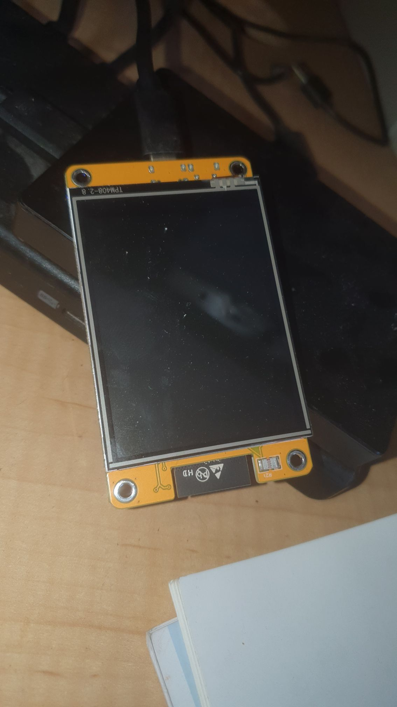
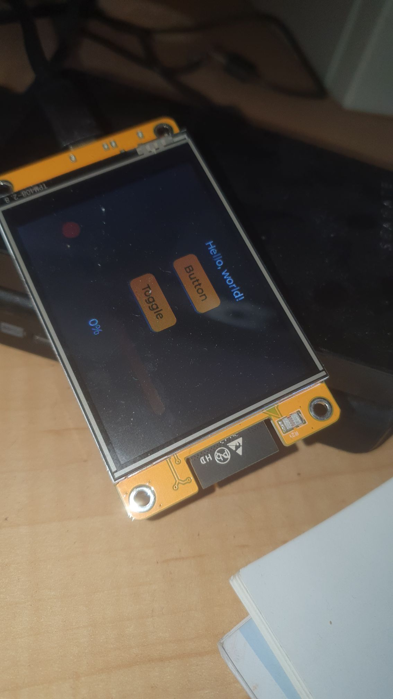
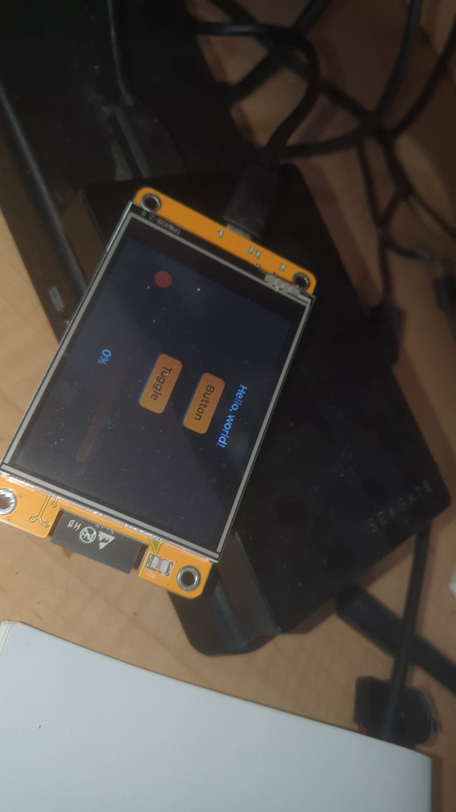
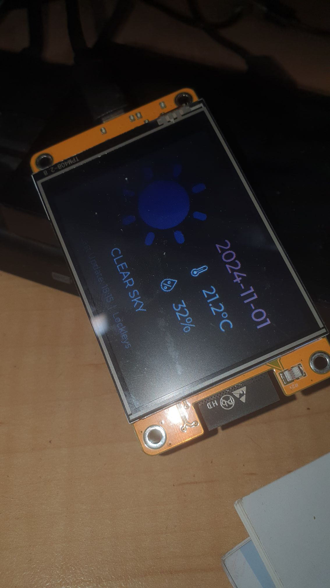
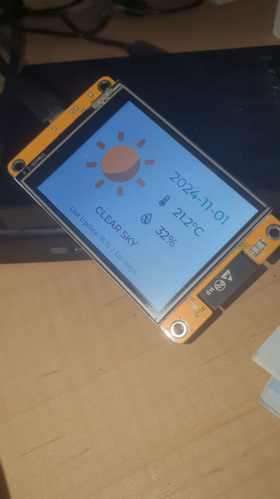

Starting with the following:


https://randomnerdtutorials.com/esp32-cyd-lvgl-weather-station/


Hopefully, starting with the libraries and the few tricks I storted out [before](https://organicmonkeymotion.wordpress.com/2024/10/22/step-1-get-a-simple-graphical-example-running/), this should be a snap!


FRAAAACKKK!


So, the build is blowing up with "`the program size is greater than maximum allowed`".


That is even after I chopped down the libraries, since I worked out this example didn't need all the same ones in the button example, so:


```
[env:esp32dev]
platform = espressif32
board = esp32dev
framework = arduino
lib_deps = 
	bodmer/TFT_eSPI@^2.5.43
;	tedtoal/XPT2046_Touchscreen_TT@^1.7.1
	lvgl/lvgl@^9.2.0
;	adafruit/Adafruit GFX Library@^1.11.11
;	adafruit/Adafruit BusIO@^1.16.1
	bblanchon/ArduinoJson@^7.2.0
```


A little digging, would you believe you may need to play with [Partition Tables](https://docs.platformio.org/en/latest/platforms/espressif32.html#partition-tables)!? With a little [research](https://community.platformio.org/t/inspect-memory-is-it-possible-with-a-release-build/18537) before hand.


**UPDATE**


So, I have mixed feelings about ChatGPT but, golly, it can pull together things that would be a chore just with web searches. Short story appears to be (in ChatGPT speak):


In PlatformIO, you can match the Arduino Tools:Partition Scheme: "Huge APP (3MB No OTA/1MB SPIFFS)" configuration by specifying the partition scheme in your platformio.ini file. Here’s how:


* Open your `platformio.ini` file.
* Add or modify the `board_build.partitions` line:


```
[env:esp32dev]
platform = espressif32
board = esp32dev
framework = arduino
board_build.partitions = huge_app
```


* The huge\_app partition scheme will allocate 3MB for the application, leaving 1MB for SPIFFS. This configuration should give you more space for larger programs without using OTA partitions. After making this change, rebuild and upload the code in PlatformIO to apply the new partition layout.


But, of course, don't take the dopey AI's word for it. [Trials and tribs, trials and tribs](https://chatgpt.com/share/6724691e-c898-800f-9009-41f3d2f8392b).


Building now (finally) with:


```
# Name,      Type, SubType, Offset,  Size
nvs,         data, nvs,     0x9000,  0x6000     
app0,        app,  factory, 0x10000, 0x300000   
spiffs,      data, spiffs,  0x310000, 0x100000   
```


My greatest fear being fragging the module so I can't talk to it no more, no more, so that I can't talk to it no mooooooooooorrrrrrrre!


Succ ……. sucky




DOH!


[](./whaaaaatttt.png)


I tried commenting out the display invert line of code I discovered. Naught.


Rebombing with the button and slider code to see if the board comes back up.




Pheeeewww!


All that and I could have just done a search to [huge\_app at espressif arduino tools](https://github.com/espressif/arduino-esp32/blob/master/tools/partitions/huge_app.csv). Shows you how dumb AI (and I) am, since ChatGPT could not get to this via principles, even given it probably had the link to the source of huge\_app in its memory bank. You'll note that even in all its stabs at the partitioning, it didn't come close to the actual huge\_app format. Noting also, ChatGPT was very clear you need no commas at the end of the lines (💩).


So I am trying a build of the buttons with the huge\_app partitioning to see if it still works.




Double Pheeew!


Now with the weather code, and the huge\_app from espressif not ChatGPT source.




Wooo hoooo!


And again with the display inverted, since that seems (for some dang reason) to be the difference between the "Arrrggh!" and the sans "Arrrgggghh!" versions.




Finally!


We therefore got there with:


```
[env:esp32dev]
platform = espressif32
board = esp32dev
framework = arduino
board_build.partitions = partitions/huge_app.csv
lib_deps = 
	bodmer/TFT_eSPI@^2.5.43
	lvgl/lvgl@^9.2.0
	bblanchon/ArduinoJson@^7.2.0
```


```
[partitions/huge_app.csv]
# Name,   Type, SubType, Offset,  Size, Flags
nvs,      data, nvs,     0x9000,  0x5000,
otadata,  data, ota,     0xe000,  0x2000,
app0,     app,  ota_0,   0x10000, 0x300000,
spiffs,   data, spiffs,  0x310000,0xE0000,
coredump, data, coredump,0x3F0000,0x10000,
```


With `#include <Wire.h>` up top, define `TFT_eSPI tft = TFT_eSPI();` as well, then call after creation of `disp` (inside of `setup()`):


`tft.invertDisplay(1);// this changes the color assignment`


Now, I just need an a page flipper, and buttons and slides for basis sprinkler control, as well as pumping weather into the home system via mqtt.
