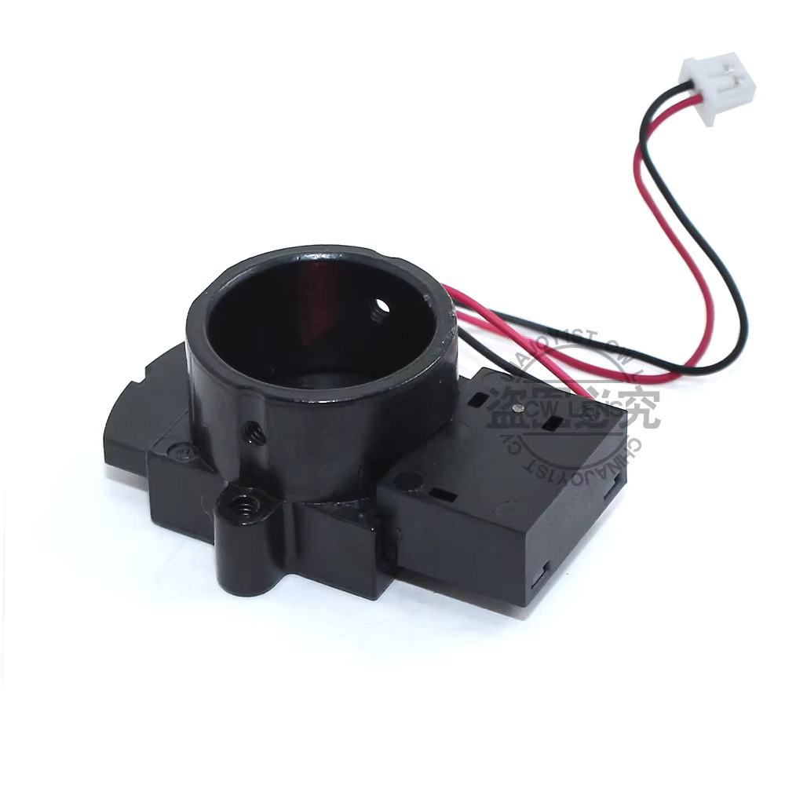
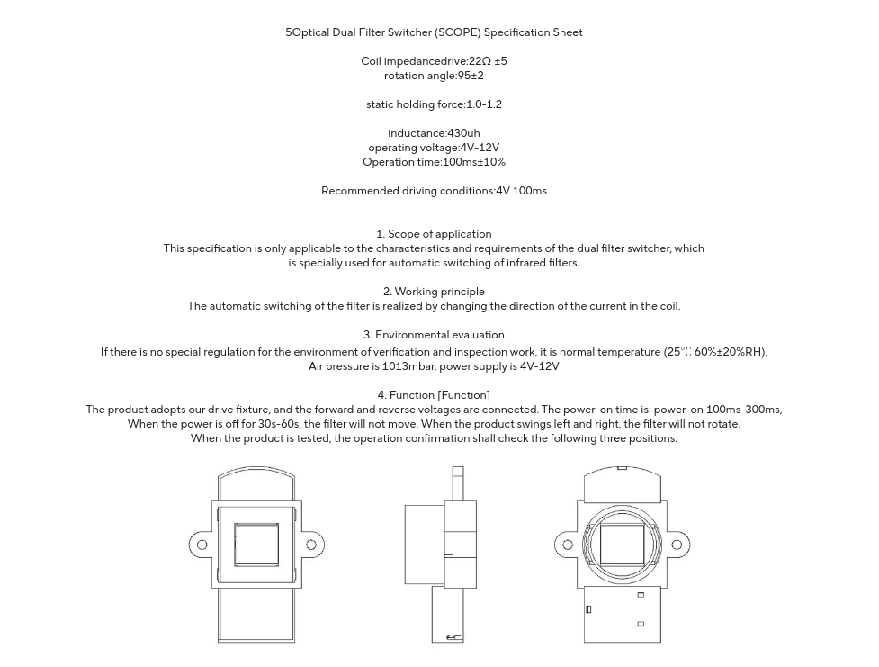
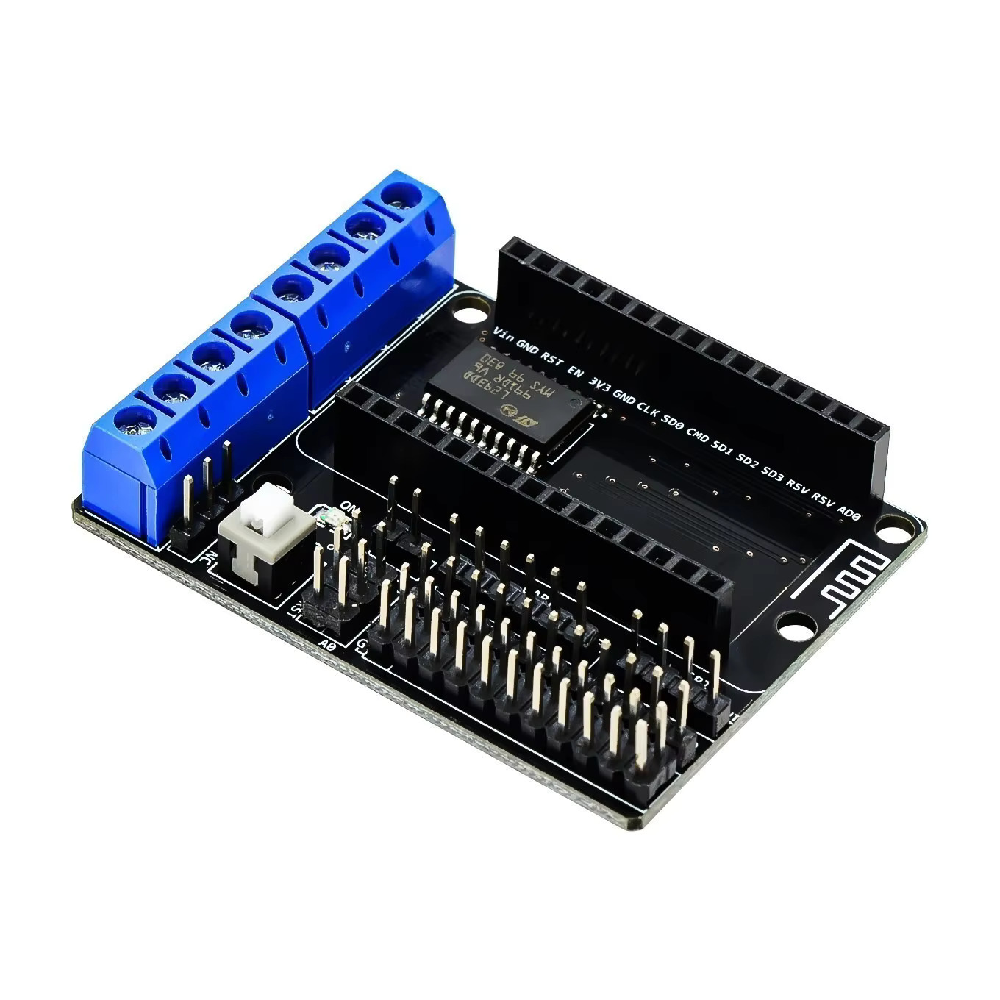

Figure 1: The "filter"

The "filter", in Figure 1, comes with the varifocal lens. The descructions are below. I am not sure it'll be needed for an animatronics application, but I think it'll be a challenge to get it working, what with a 100mm 4V pulse to open and then, apparently, the voltage inverted to close.

Might as well have a hack.

Turns out the trick might be to use one of the ESP8226 boards and motor shield I grabbed, Figure 2, and simply wire up the 4V across the two motor inputs (back to front on one of them) and simply wire up the two outputs together. The pulses (inverted or otherwise) then driven by the presence of an enable for one or the other half of the L293D.

Figure 2: The "motor" board with the L293D conveniently sitting on it.
