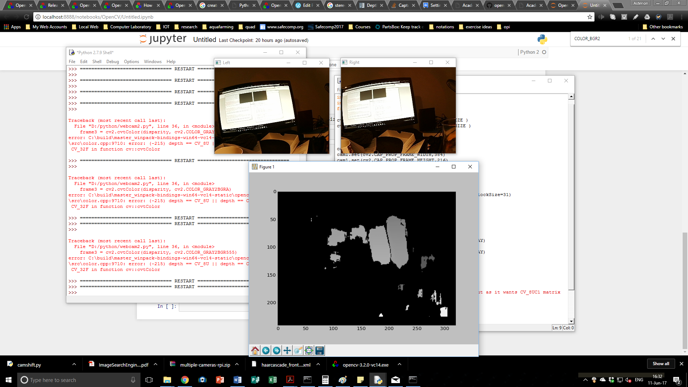

Ah well, so some tricks when using the disparity functions for generating stereo depth.  The frame from each camera needs to be converted from color to grayscale.

I have a suspicion the output is knobbled because I may need do something about calibrating this stereo pair first.  There are also processing bin sizes I can play with.  However, this is an "interesting" way of getting stereo depth but I am just buzzing out the setup using Python, OpenCV and the new camera.
The other quirk.  I seem to need to use matplotlib to draw the disparity map (being its a grayscale?).  I tried reversing the cvtColor function to go back to GBR - since the plot function of matplotlib holds the processing loop (I have to hit the window close button to loop).  Something to sort if I wanted motion displayed.
Work to go then, sort out stereo camera calibration, then try the disparity code again.
