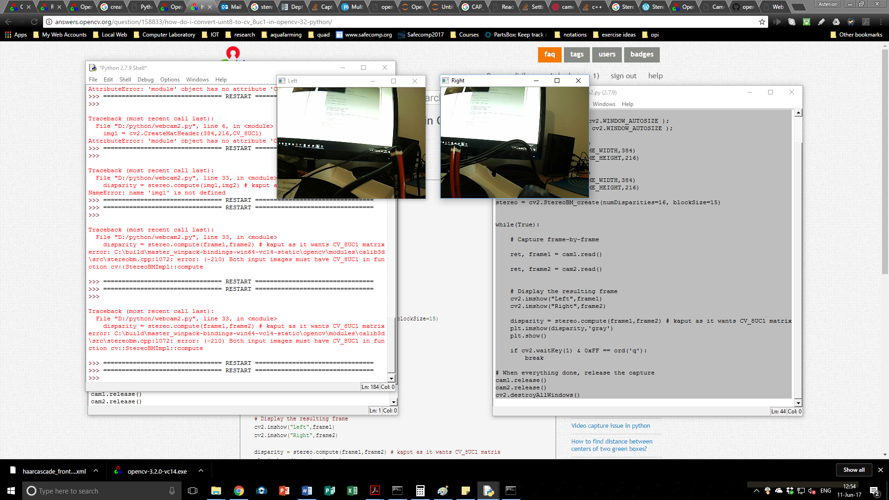
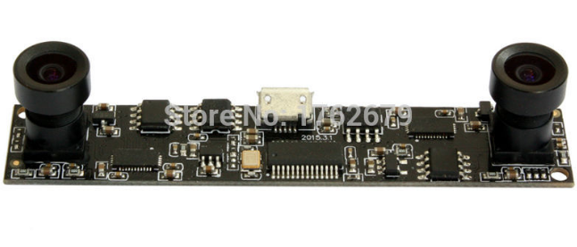

With some pain I got the stereo camera that turned up the other day, from aliexpress, to work (provisionally).

This is on my windoze PC using 64bit Stackless Python and OpenCV 3.2.
Trick, that stopped me for two days, was working out the problem where one or the other camera would work.  But both together hung.  I would swap order and get same thing.
Turned out to be USB 2.0 choking.  So fix was to work out how to set the image size small enough for the two camera streams to cooperate on the on USB port.
Camera is this one:

Which has specs of: 1280\*720 MJPEG 30fps 120 degree dual lens usb camera module HD CMOS OV9712. Which is, as it turns out, a lie in this configuration.  The device is USB 2.0 so will choke when trying to pump both through at the same time.  Some work will be needed to sort the maximum resolution that the cameras can be set to - there is likely some black magic math somewhere (or trial and error).
I haven't used much science in the selection (I waited until prices dropped and grabbed the lowest price one at the time).  I opted for wider field of view because I suspect that creates greater disparity between points to help localisation - however, don't quote me as that is not back up by any reading at the moment.
The hangup, at the moment, is that while the two cameras are working, OpenCV does rather have various matrix types and so the rotten thing (as usual) "thin"  or sporadic documentation.
If you find "help" any it will be using deprecated functions (from previous versions of OpenCV) or in C++ etc.
Even just a disparity map, that uses the stereo image to show depth planes, needs matrix conversions.
Still, once these are worked out I can buzz out a design on the PC before migrating to an embedded form factor (C.H.I.P., ODROID-C0 or Orange Pi Zero, perhaps even old Android phone).
I am after something to pump a point cloud out.  Using mono-slam is fun but I am not sure that having to get the camera video processing and platform pose working together is happiest medium - since people are helping out with stereo camera like this especially.
