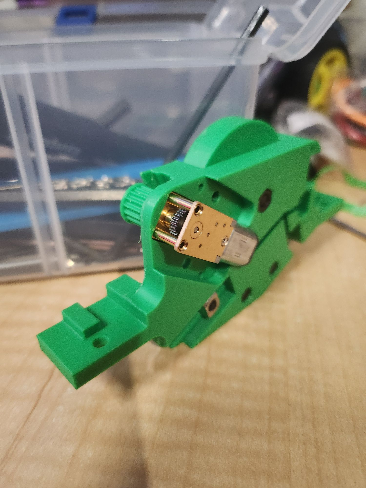
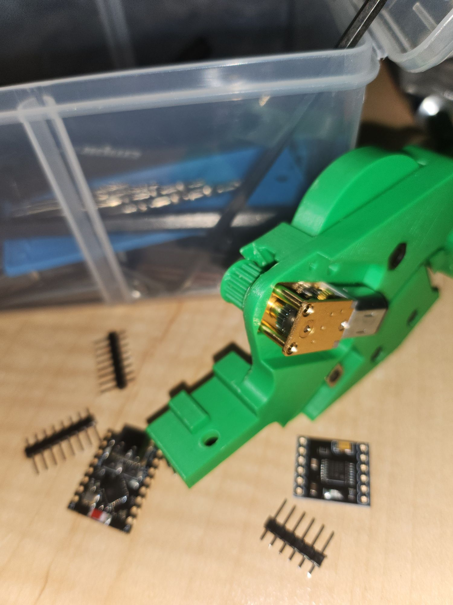

So the N20 turned up and again the design of this feeder rocks!

Such a snug fit. It has a cover to screw down over the motor but that's  for later once I get the boards from PCBWay.

For now I'll work on a prototype setup.

I just need solder some pins. I am still waiting for the IR encoder. Then I can start porting the code.

