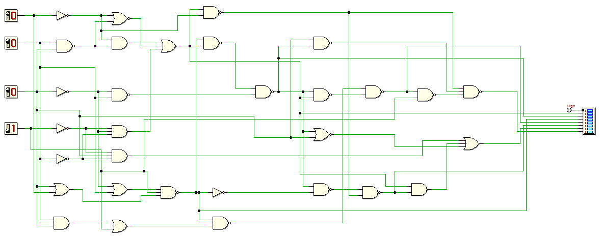

[Following on ...](http://organicmonkeymotion.wordpress.com/2014/10/22/not-quite-right/ "Not quite right")
Near as I can figure:
[caption id="attachment\_1637" align="alignnone" width="660"] Switch setting be eight Arrrgggh! Oh, sorry this be FPGA not Raspberry Pirate.[/caption]
Is the same as this:

And cycling through all switch settings, I do not get "segment" B lit >9 (as expected).
Need to check the coding again.  Unless I duffed it and missed a coding problem the only thing after that is compiler error.
Stay tuned.
