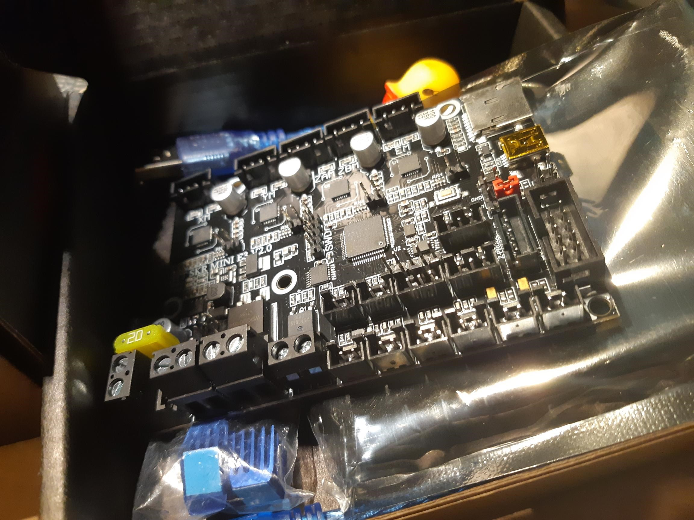
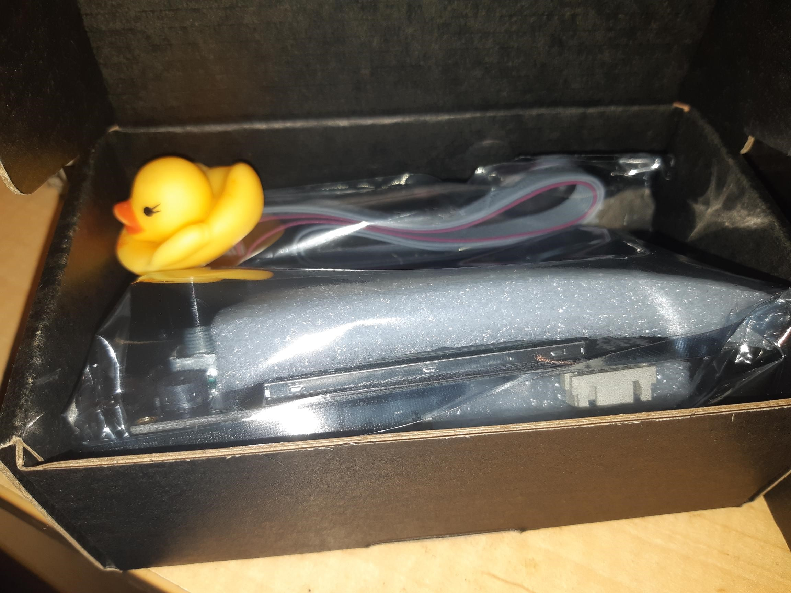
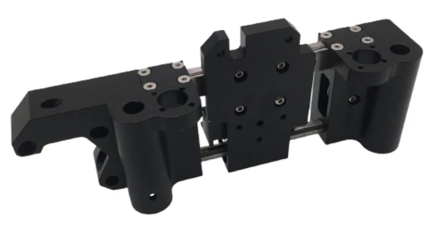
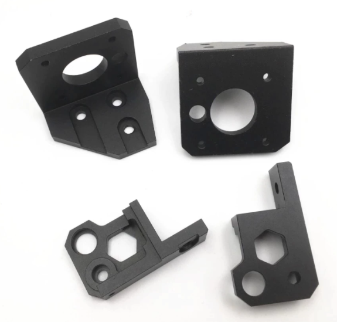
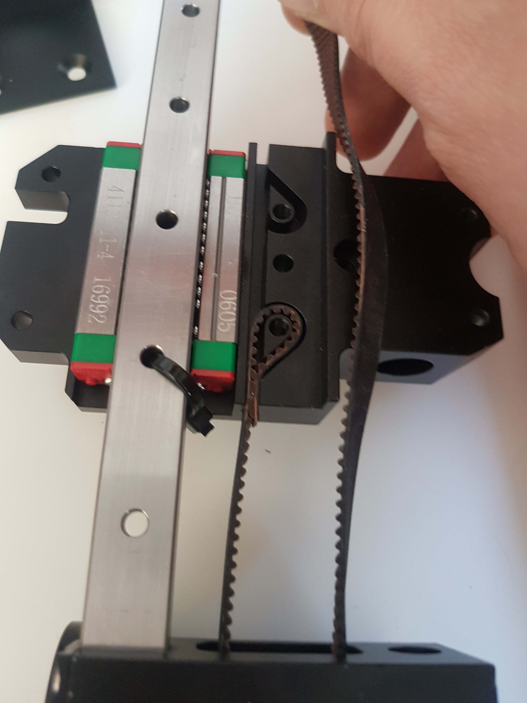

So, my BigTreeTech SKR Mini E3 V2.0 turned up (finally), along with companion display.

So, I will have to do a stocktake to make sure I have all the hardware to then press on with the Bear build. I neglected to keep track and so I think I still have a couple of minor things to get.

I have the two taller Z-Axis motors and threaded shafts but I think I will either have to sort the X-carriage and I haven't talked myself out of a **[Funssor Prusa MK3 / MK3S X-Axis Linear Rail Guide Upgrade kit Prusa i3 Hiwin MGN12H linear rail conversion mod](https://www.aliexpress.com/item/1005001479537611.html?spm=a2g0o.productlist.0.0.5ceb7ab175KVkd&algo_pvid=b4e78e72-cf2d-40ab-9ca7-ac6fbc65ddc7&algo_expid=b4e78e72-cf2d-40ab-9ca7-ac6fbc65ddc7-13&btsid=0bb0623316200340914285232e4165&ws_ab_test=searchweb0_0,searchweb201602_,searchweb201603_)**.

Neat but limiting, since you appear to be restricted to the Prusa i3 MK3s R4 extruder. However, while I have been excited at some of the higher end extruders, I am still learning this stuff so happy to have a constraint.

Not to mention aluminium z-axis mounts designed for the bear upgrade, though looks like V2.0 and not V2.1.

So, why you wouldn't is apparently there is a design flaw in the x-carriage design. The x-carriage actually seems to interfere with the returning belt, or so the reviewer of the vendor has warned.

DOH!

DOHDOHDOHDOH...

Might be fine if they dropped the carriage and just sold the end widgets with rail.

I think we've another award brewing.

Ali the Crapper Award

This flawed funssor option otherwise seems similar in intent to [this](https://www.prusaprinters.org/prints/16838-prusa-mk3-mk3s-x-axis-linear-rail-guide-upgrade-up/files) work, which actually has options for various print heads - but its back to a 3D printed set.

But it does give me the option of a BondTech extruder and others.

NICE!

Not to mention that Marlin config comes close to helping us out [with](https://github.com/MarlinFirmware/Configurations/tree/import-2.0.x/config/examples/Prusa) a prusa but also a BTT config, albeit a different BTT board. So a gentle intro to Marlin.
