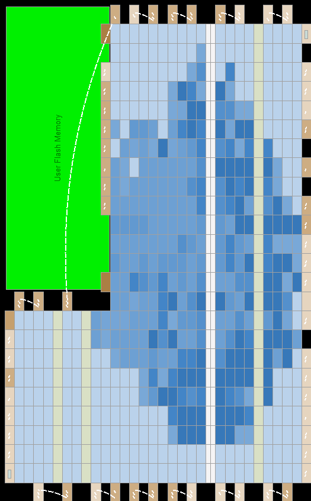

God. I am like a little kid. Turned 56, my parents sent me a check. I hid it from the wife and bought myself a BeMicro MAX 10 board.

So, first thing was not "hello world", rather I jammed on the [uCore FORTH CPU](https://organicmonkeymotion.wordpress.com/2014/09/17/heres-the-thing/) to see if it would fit.  It seems to have more room than on my EP2C8Q208C8N board!  Whats more it is the configuration I am after for a general purpose FORTH board.
Now, options include getting uCore up and running with Avalon bus connectivity.  The other option is very sentimental.  I have the bin dump for RSC Forth for the 65F11/12 which is essentially 6502 with extras.  Might be fun to get that going on the board as an exercise.
Of note however:

# Die Seite steht zur Zeit nicht zur Verfuegung

That is the uCore website is not available.  Interesting, the shortcoming of uCore seemed to be the licence arrangement.  Now if the site is down what does that mean for the licence.  The issue with the licence is that it limits commercial use - so what if you've no commercial intent.  However, begs the question.  If the site is down because the owner's interest has waned then how much of that has been influenced by the licence turning people away.  It is a FORTH implementation after all, which is a niche market likely of people, like myself, with some sentimental attachment only.   Why have commercial limitations then on an unproven implementation in a sphere not widely trodden?
