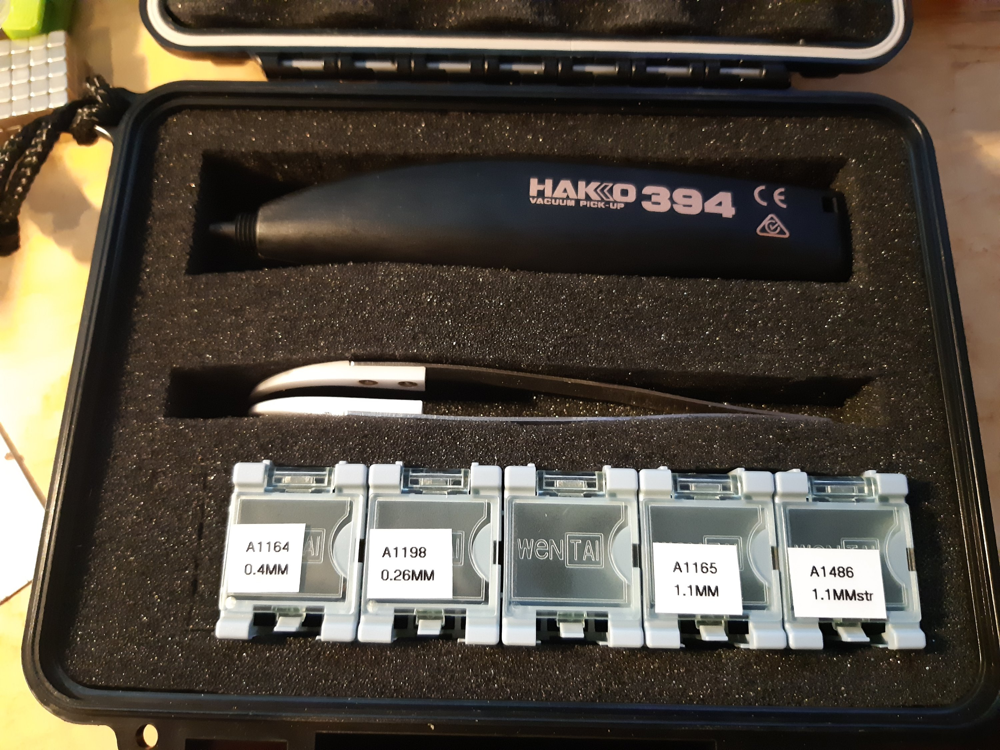
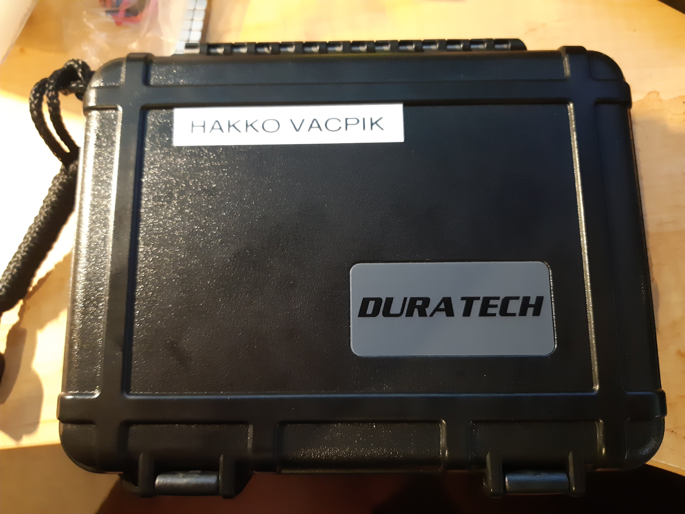

Vacuum pickup by HAKKO.

I bought a full set of optional picks and nozzles. A had a [gaggle of small trays](https://www.aliexpress.com/item/32285585504.html?spm=a2g0s.9042311.0.0.27424c4dXNjJDa) for small parts and they fit perfectly. The centre one has all the nozzles (which reminds me, where is that pesky labeller?).

Case by DURATECH

Thanks to [Mektronics](http://www.mektronics.com.au) ([HAKKO 394](https://www.mektronics.com.au/hakko-394-vacuum-pick-up.html)) and Jaycar ([DURATECH ABS Instrument Case MPV0 CAT.NO:HB6389](https://www.jaycar.com.au/abs-instrument-case-mpv0/p/HB6389?pos=17&queryId=be3f80d51432f71ff8cd6765dd4772f5&sort=relevance)). If ordering the [optional extras for the HAKKO 394](https://www.hakko.com/english/products/hakko_394_parts.html), contact Mektronics with the part numbers, as they have so much stuff, some of it won't have made it onto the website.

The tweezer was from a set I ordered from Aliexpress, by mistake, but definitely required to pick the small items out of the boxes. Those tweezers are a must!
