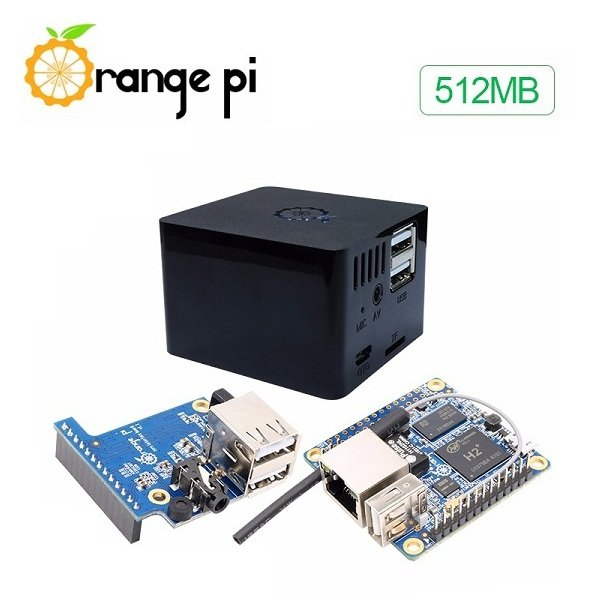

... or in.
To give my cluster back an ODROID-C1, I got a 512M Orange Pi to host the mqtt and node-red for my house automation.  It is tini, even with the case ( a couple of match boxes in size ).  So, un-obtrusive to boot.
I will get a couple more once I have sorted some software to monitor my barking dogs.    Python based signal processing to detect the dog back and then, perhaps, hooked into sprinkler zone the dog barking is detected in.
I have an IR sprinkler guarding the side of the house.  Neighbors complained that they'd been barking daily for 12 months, why wait 12 months before telling me?  So they became set in their ways.  However, the sprinkler works the dog psychology as it breaks the fixation on the noise.
However, of course, I want to be a little more sophisticated.  I want to record the activity so I will get a camera for the OPi later.  Wifi it up to the home PC.  Because it has GPIO ports it could also drive a solenoid valve, a horn or a shaker (marbles in a coke can will distract the dog as it doesn't like that type of noise).

Parallela turned up so it and the C1 will be fitted this weekend.
[I relented on the idea of an old multi cpu server](https://organicmonkeymotion.wordpress.com/2017/01/18/i-am-in-so-much-trouble/).  I am fickle ... I know.
