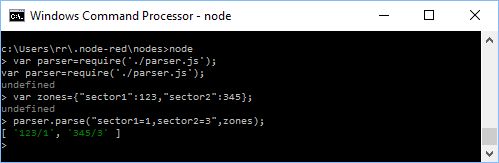

Ah ha!
I had some trouble importing my pegjs parser function into the node console until I worked out node and/or javascript treats directories as "/" whereas windows uses "\".
So finally the import is simply:

```
var parser=require('./parser.js');
```

I also hand modified the parse function signature which is now:

```
function peg$parse(input,zones, options) {};
```

I worked out that zones needed to go ahead of options as calling "parse(input,,zones)" wasn't a popular choice with the javascript.
The input variable "zones" will come from the configuration node.  That way the parser will take the configuration object [{sector1:chipid()}] and return the mqtt topic fragment "chipid()/zone[0..4]".
So, the modified parser tested using node console shows it working:

Now all is needed is the use the zone "grammered" string in the google event title and snip it out, when the event starts/stops.  This is achieved with msg.payload.title as the first parameter in the call made by the node reacting to the calendar event.
The array returned can either be iterated over using a for-loop OR be returned by a node-red function to be treated as a stream of messages (aka msg).
I have a sneaking suspicion that, in fact (and having read the code and how it uses "options"), I [could|should] have injected the zones via options.
Something to play with I think, as it doesn't seem clean to hand mod the parser code.
