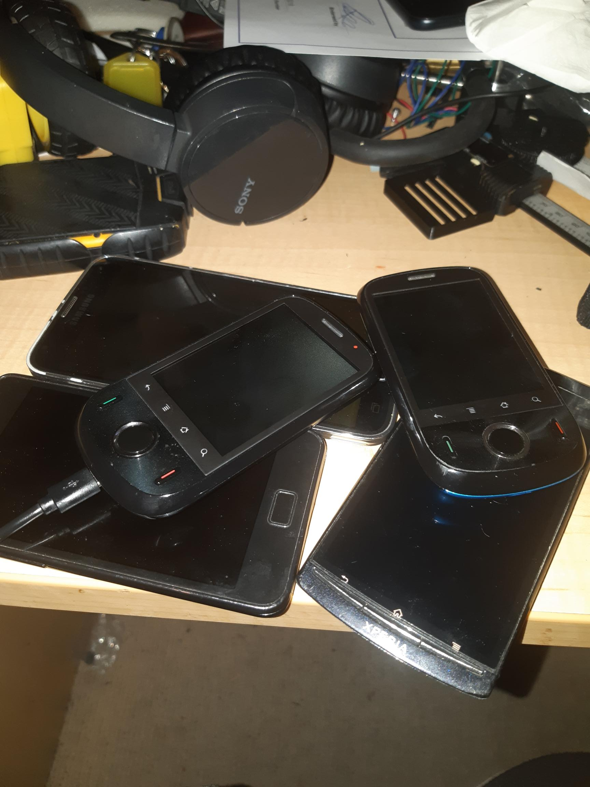

No not that crass one, the ominous one.

Figure 1

So in Figure 1 there's a pile of old Android phones I have collected. Including my trusty Galaxy SII that was used to provide vision to my robot hacks.

I found a not bad IP camera front end called [motionEye](https://github.com/ccrisan/motioneye). Popped the docker container for motionEye onto the Raspingdoodlebury Pi 3 my house is running on.

Phones are running different versions of IP Webcam app. Different since the oldest phones are running Android ... what for it ... 2.2! So I am using latest drop of 2016 versions for those older phones. They may run 2017? Don't care at the moment, as it was a laborious trial and error downloaded and trying to find a version that would install.

The motionEye front end has quirks. Firstly, I think it expects a camera once set up is, well, up. If you turn the phone off, or leave the screen lock on (an you haven't told the IP Camera app to run in the background), motionEye doesn't seem to want to keep the camera up on the screen. Most times you can just refresh the browser you're watching on. BUT, and there's always a but, there's a fair to middling chance that you have to delete the camera from motionEye and then re-add it?!?!?!

Also have an S8 that I bought when my A8 charging connection started to play up. I ended up sorting (really tolerating) a dodgy connection that seems to evolve, because of the crap design. So I am still using my A8. I have ordered a sim card for the S8 to set the S8 up as another IP Camera, but also to host a REST based SMS gateway, so I can send messages from the house server to my phone, and hopefully also from the phone then to the house server, when I am away from the house.

I am hacking up a simple app, to work on my A8, to tell the house server I am on the LAN so please don't send me pesty SMS messages etc. That might actually also be possible by using the presence of the HA app on my phone to work that magic. I need to poke around with the available flag I of the associated entity I supposed. So, a few fun weeks of HA configuration, again.

The downside, is the Home Assistant integration for motionEye, happily leads to camera entities automatically being recognised BUT the fracking things are always UNAVAILABLE! Not a lot of help sorting that, it seems you have to jump into ADVANCED mode to setup a simple MJPEG IP Camera?!?!?!?

**UPDATE**

Solved. When setting up the camera in MotionEYE, if you use the Network Camera and not the simple MJPEG option, then HA can "see" the camera. A bit dopey, since the difference is explained as "if you dunna want motion detection", that read as "if'n yawl only wants to use the video stream". Odd then that you don't get the video stream if'n yawl only wants to use the video stream.

Note, if you're using MotionEYE on the same host as HA, and you've crafted up a docker-compose file to run up the server, you can certainly set up the MotionEYE integration with " http://motioneye:8765 ", if you set your MotionEYE container to ... err ... "motioneye" that is.

It also work backwards. That is, your webhooks, from MotionEYE back to HA, can be " http://home-assistant:8123/api/webhook/etc " for example.

I also worked out also that, if you are using the webhooks in MotionEYE, to call automations on HA, if not using the container name, you'll need the real IP address of your HA host in the URL. That is "x.x.x.x" and not "black-pearl.local", as MotionEYE appears not smart enough to use that idiom.

Gotta love docker right?!
