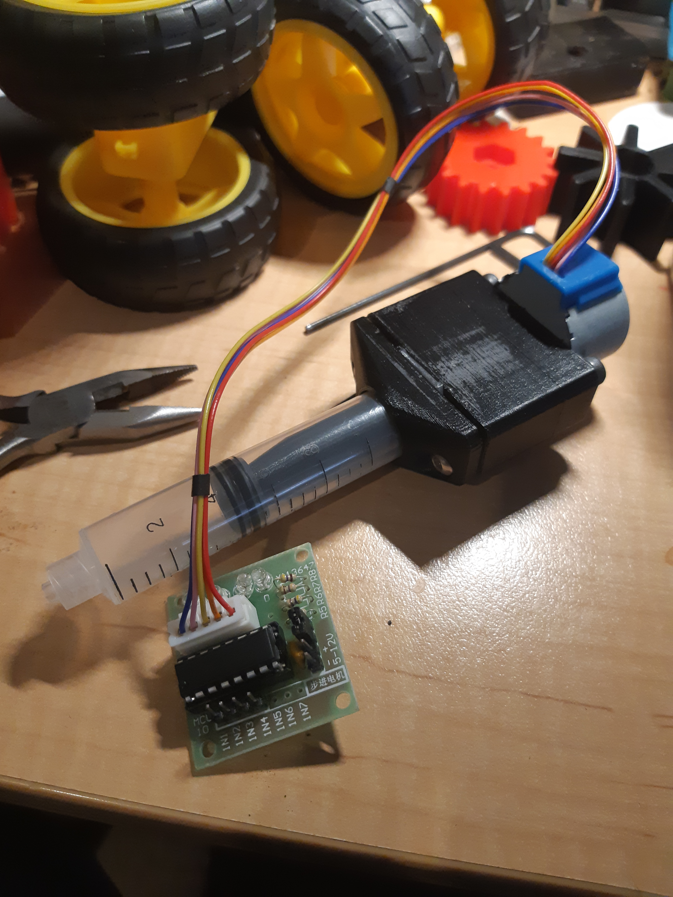

So, yes. Having fully assembled the handheld solder paste dispenser, while the solder paste stencil for the main board is yet to arrive, why not hook it up to an Arduino and try out the mechanicals?

I think I may have problems with the 3D printed connector between the motor spindle and the (what was) M4 80mm bolt that I cut the head off, to be the thread for the plunger.

Figure 1 refers. I guess we can try it now?!

Figure 1
