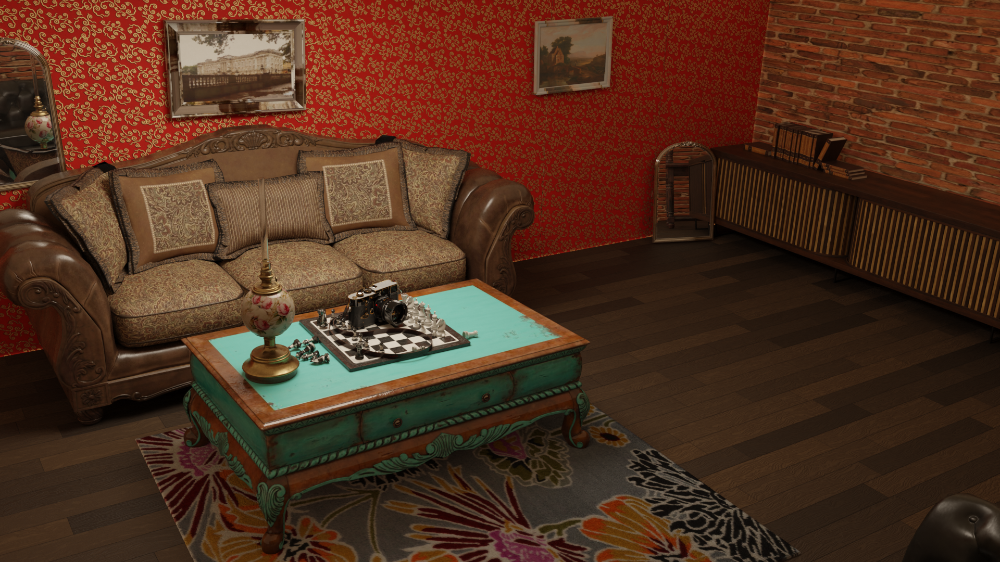
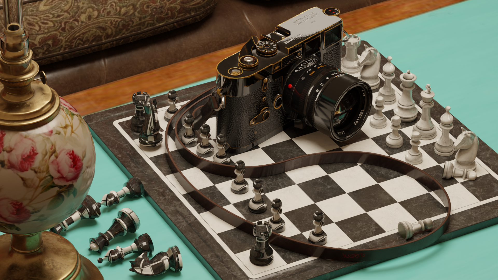
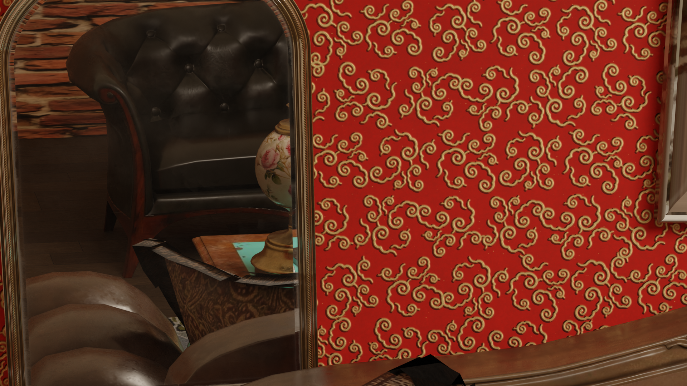
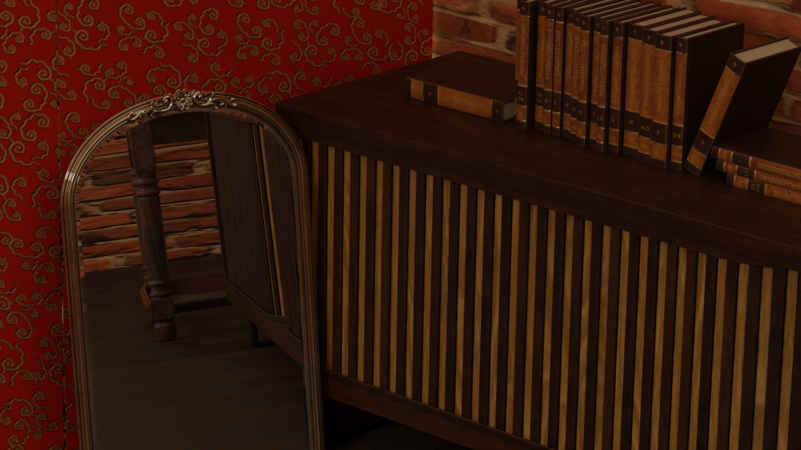
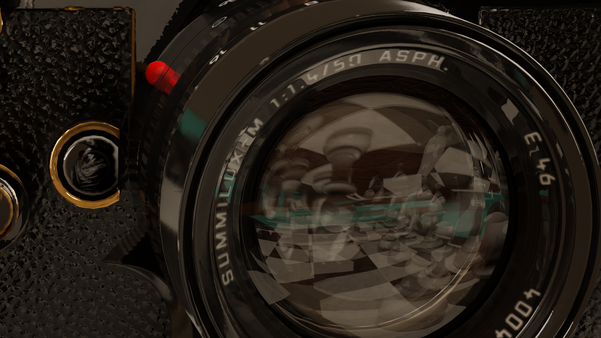
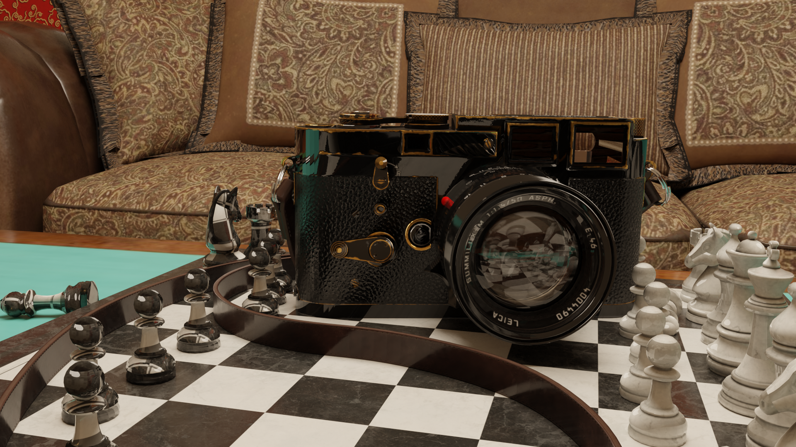

I have never done a composition render of a still. So, thought I would look at this and see how the new MonstaPC held up.

The image above is using the following model assets from PolyHaven.

* <https://polyhaven.com/a/sofa_03>
* <https://polyhaven.com/a/sofa_02>
* <https://polyhaven.com/a/ornate_mirror_01>
* <https://polyhaven.com/a/CoffeeTable_01>
* <https://polyhaven.com/a/WoodenChair_01>
* <https://polyhaven.com/a/chess_set>
* <https://polyhaven.com/a/book_encyclopedia_set_01>
* <https://polyhaven.com/a/hanging_picture_frame_02>
* <https://polyhaven.com/a/fancy_picture_frame_01>
* <https://polyhaven.com/a/vintage_oil_lamp>
* <https://polyhaven.com/a/Camera_01>
* <https://polyhaven.com/a/modern_wooden_cabinet>

The rug is an image of a rug with a particle system attached based upon ideas from [this tutorial](https://www.youtube.com/watch?v=93EbuYU9Wrg), although you could [go here also](https://www.youtube.com/watch?v=_0PcCoqAYwk). I want to investigate adding some wear and tear at some point.

I deliberately dishevelled the chess pieces with the camera, or at least arrange the pieces as if the camera had been placed on the board, so as to dishevel the pieces.

I used the mirror twice. I had to change the shader that came with, so as to actually turn it into a mirror. I used the mirrors and the wonky hanging, or setting on the floor, to draw in the second sofa and wooden chair - both mostly or completely out of shot otherwise.

The encyclopedia were separate books, so I juggled them to make them somewhat unkempt.

I also changed the material for the camera lense, such that in close up shots it does reflect etc, but is otherwise translucent to give a hint of being a "lens".

Paintings are hung slightly crooked. While that grates me in real life, tips abound on the idea that life is not perfectly arranged. So the mat, the coffee table and the black sofa are skewed somewhat.

The brick wall is the texture <https://polyhaven.com/a/brick_wall_006>.

The trick I found, with [the wall paper](https://www.texturecan.com/details/158/), was actually to "lay" it with 1m wide strips. That way you can leave gaps, or misalignments. Subtle but there. I even tried using the bump/displacement from the brick wall, to try to give the impression the wallpaper had been glued over the brick wall. Initial experiments didn't work, but I will look further into that. I am looking also at working out how to damage the wallpaper. It might even be fun to have a weathered paint peeling off the wallpaper etc.

The piece de resistance is the floor, which I based upon a [tutorial here](https://www.youtube.com/watch?v=EoQgq7n9Rwk&t=430s), by Default Cube. I still want to "stress" the wood and add dust. Which reminds me, it might also be interesting to have dust in the "volume".

I will eventually have to look into more sophistated lighting tutorials. The scene is currently bathed only in a 40W area light, with a softened yellow tinge.

Oh yeah, almost forgot. I ditched the material supplied with the glass tube on the vintage oil lamp. I just replaced it with a glass shader.

Now, I was using 4K assets and seemed to get away with that, up until I added the second painting (really being the last item). The GPU choked and blender spat out an out of GPU memory. I backed all the assests back out to 1K assets (really just by painstackenly changing the exr/png references) and then it came good again. Lesson learnt in any event, I don't seem to need more than 1K assets, or more than 16G, for the moment.
