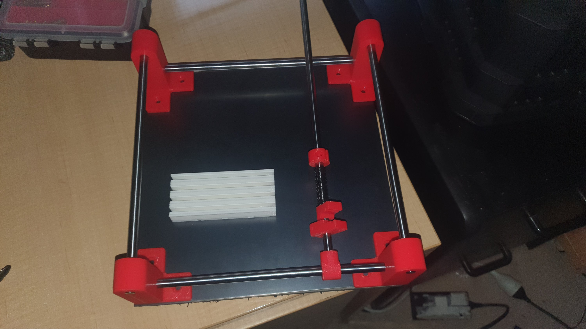

So, for AUS$15 I got me a 1.6mm thick mild steel plate, for the base of me mini manual PnP.

Why?

The white widget is an SMT holder, that I 3D printed. It has magnets in the base.

I still need clean and then paint the plate. Red, of course.

I may change the design of the corner posts to include holes for heat sets, to hold the linear rods, by using grub screws. At the mo, the plan is to retrofit heat sets by drilling holes.

That's what you get when you hack a design.
