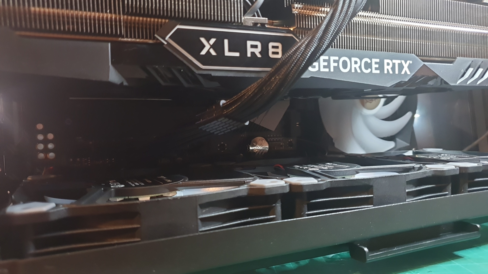
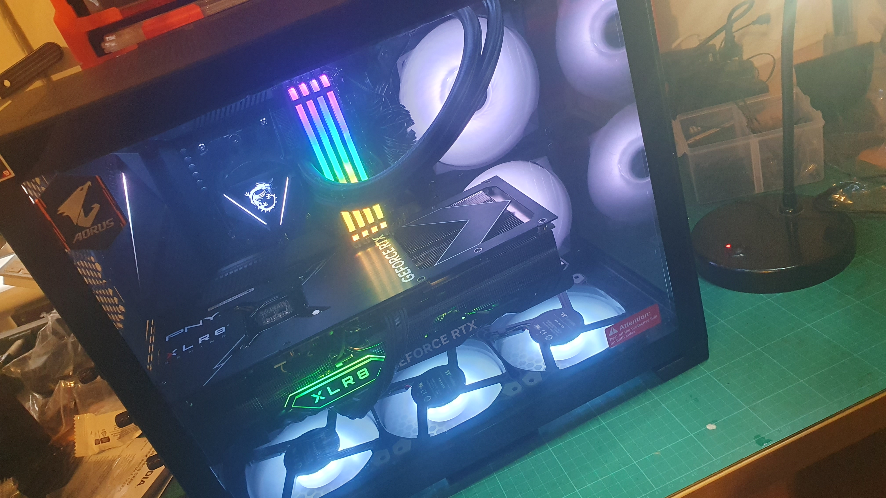
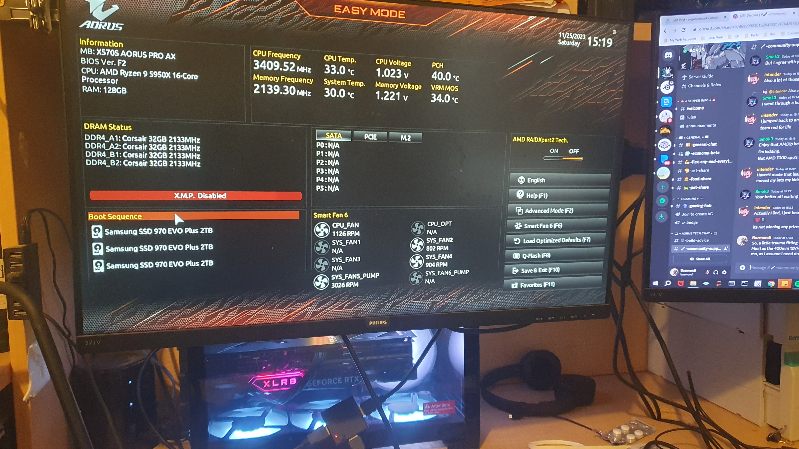

So this is the 12VHPWR extension cable I picked up off Amazon.

Deliciously pliable and now peeks out into the tray handling well where the 12VHPWR that comes with the SF850-L pokes out the other side. This also ensures the cabling is getting a blast of cooling air, although yes it does likely also warm the air going to the GPU fans.

At the moment, it'll do until I get the system setup, as I am not planning to overclock.

I noticed, in the process of installing this, I did disconnect one of the ARGB feeds, so a little fiddling and then a test power up.

Next steps:

* Double check wiring (again and again).
* Power up.
* Look for the still elusive HDMI output.
* Burn debian image to USB ready for install.
* Fiddle with BIOS settings.
* Install linux.
* Install <https://openrgb.org/> and get the LED dancing!
* Take a deep breath.
* Look at how to get the GPU up.
* If really lucky install Blender and do a couple of tests, namely take the [New End Scene](https://organicmonkeymotion.wordpress.com/2023/04/18/new-end-scene/) file and try first to render it, in Cycles, using the CPU (since I'll have a 16 core/32 thread service).  Then I'll re-render using GPU.
* Then, SCREAM!

Must walk the dogs first though, they've been pestering.

VERY TIDY!

So who's dangerous now?! Mwahahahahaha!

UPDATE

I got Devian 12 onto the first 2TB drive. However, problems booting up?!
