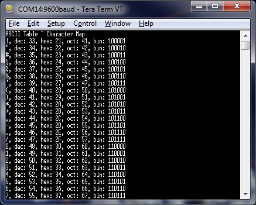
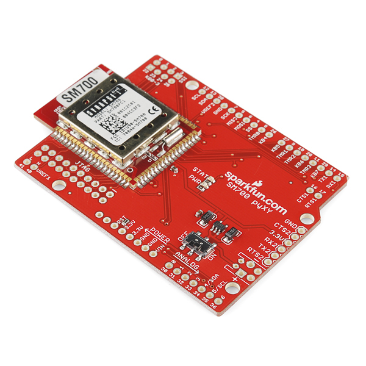

So, were did we come from:

* Bought a [Flyduino](http://www.dfrobot.com/index.php?route=product/product&product_id=505#.UB4NXU2wzng "12 Servos, MCU and XBee") and a [DFRobot Xbee USB v2](http://www.dfrobot.com/index.php?route=product/product&filter_name=xbee&product_id=588#.UB4N0k2wzng "Uses an ATMega instead of a USB to serial chip") for the [swash bo](http://organicmonkeymotion.net/Platforms.php "Take a RC approach and make it semi-autonomous")t work.  Didn't buy XBeezzz at the time.
* Found Synapse Snap RF266PC1 claiming to be XBee form fit replacement.  Looked like a good way of expanding the compute power of the Flyduino as well as allow for over the air programming.
* Ordered 2\*RF266PC1 from an anonymous vendor without quality control in their order processing so four(4) turned up (or at least 2 turned up twice).
* Found RF266PC1 and DFRobot XBee USB v2 combo did not work as Synapse/SNAP Portal node either or both because the AT Command script that comes on the RF266PC1 knobbles the mesh mode OR (most likely) the DFRobot XBee USB appears as a COM - not a USB port - to Portal (so Portal cannot "see" it).
* Ordered a [Synapse USB dongle](http://www.synapse-wireless.com/snap-components/snap-stick/usb-module "\"all\" wasn't all") to find typo information on web page (since fixed after an email I sent to Synapse) led to my having a USB dongle (plus AU$20 postage) that had a different form factor to the XBee clone RF266PC1.
* Ordered an RF200PD1 (plus AU$20 postage), with an external aerial, to now have a portal node.  Most Synapse modules have a footprint which is different to XBEE because you have to have two footprints for small RF modules don't you.
* Downloaded demo script from SNAP Reference Manual "Sample Application – Wireless UART" onto Portal node to find that you loose access to the SNAP network once you do that.  This useful warning turned up in a third party website (not associated with the vendor) sometime after I sorted the problem, but didn't appear to be discussed in the SNAP Reference Manual in and around the example as you would expect using good tech writing authorship.  Makes sense though, "bomb" the Portal node last.
* Found I couldn't erase the script on the Portal Node on the USB dongle.  Turns out, once you download the "Sample Application - Wireless UART" Portal no longer "sees" the Dongle as a USB device.  Found out a deprecated function needed to be used to tell Portal to talk to the module as a COM port as this was the only way then to erase the SNAPpy script.  Had to download and install VCP drivers for USB chip on Synapse USB dongle to allow Portal to see the COM port.  Then Portal baulked when erase was sent to module .  Nowhere in a useful place does it talk about having to reset the module as part of the erase.  Mind you, the vendor also decided to leave a reset button off the USB dongle so one had to short two pins on the module to get the erase to happen at all.  There was a reason for this (apparently) you (meaning me and you) were not supposed to want to erase a script in a module inserted into the SN132 USB dongle.  We (you and I) were supposed to know that before purchasing the dongle.
* The upshot, final configuration then is an RF266PC1 sitting on the DFRobot USB dongle, AT Command script erased and replaced with UART script  (just used the script DatamodeNV.py that comes with Portal) and running as one of my COM ports on my laptop.  RF266PC1 sitting on the MegaProtoboard XBee socket sitting atop my ArduinoMega, AT Command script erased and replaced with UART script.  RF200PD1 sitting on the Synapse USB dongle (SN132), [restored to factory settings](http://forums.synapse-wireless.com/showthread.php?t=3247 "The pain, oh the pain!"), up and running again and to be left alone as the mesh access node.  ***All this took a fortnight to 3 weeks of forensic research, additional purchases etc.***USB Stick ([SS200](http://www.synapse-wireless.com/snap-components/usb-Mesh-zsnap-stick "No reset so you can potentially \"soft brick\" it")) may not be optimal either as it also doesn't have a reset switch - although the response from vendor was later versions of it are changed to force a reset on update over air.  The problem becomes when you are using it as a Portal node, you end up having to have a second module to act as Portal node as a fall back.   I've opted to commit a RF266PC1 to sit on the DFRobot XBee USB v2 as my UART/COM link and keep the RF200PD1 as the Portal node.
* So, finally SNAP impersonating XBEE sending Arduino ASCII table example to my Tera Term VT on COM14 (which is the RF266PC1 sitting on the DFRobot XBee USB v2):

Now, at least, I can start sending MAVLink over the air (though I am suspecting much of the MAVLink code can go now as you should be able to send it over the SNAP link to get the same result).
Note that I have also seen a link were someone was downloading Arduino sketches over the SNAP link, something you apparently cannot do with the XBee.  The thick plottens as this means I should be able to program the Flyduino wirelessly while experimenting with gaits.
If this all works out, as I use up my arduino based boards I will likely migrate to the [pyXY - Synapse SM700 Dev Board](https://www.sparkfun.com/products/11176? "RF plus MCU") for distributed embedded robotics.

POSTSCRIPT
You can (probably) use an RF266PC1 as your portal node but you need to use a recognized USB to XBee dongle.  Likely has a USB chip rather than a pesky ATMEGA8U2 (as does the DFRobot XBee USB v2).  Something like the XBee Explorer/Explorer Dongle - THOUGH you will need to erase the SNAPpy AT Command script by powering up the module, say in any Arduino with XBee socket OR on a USB dongle (not connected to Portal as the root node).
